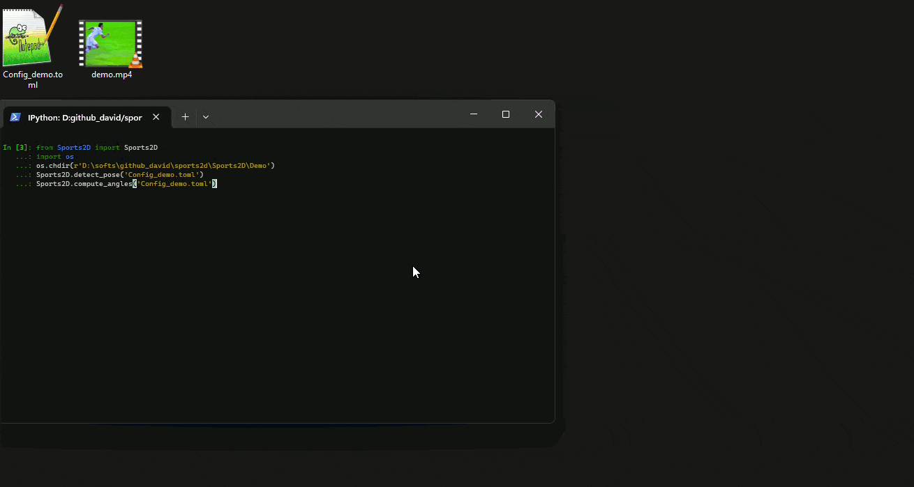
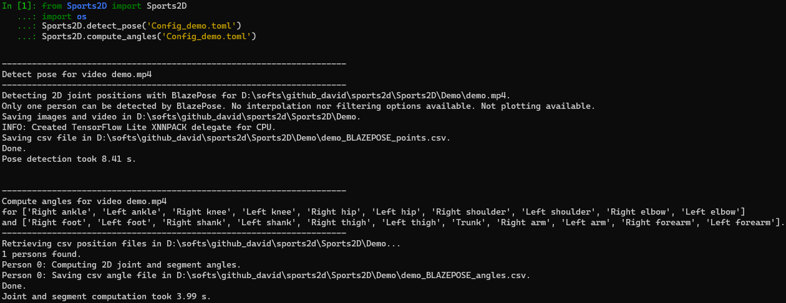
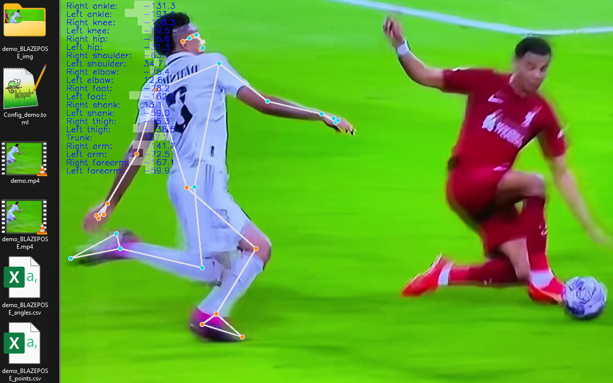
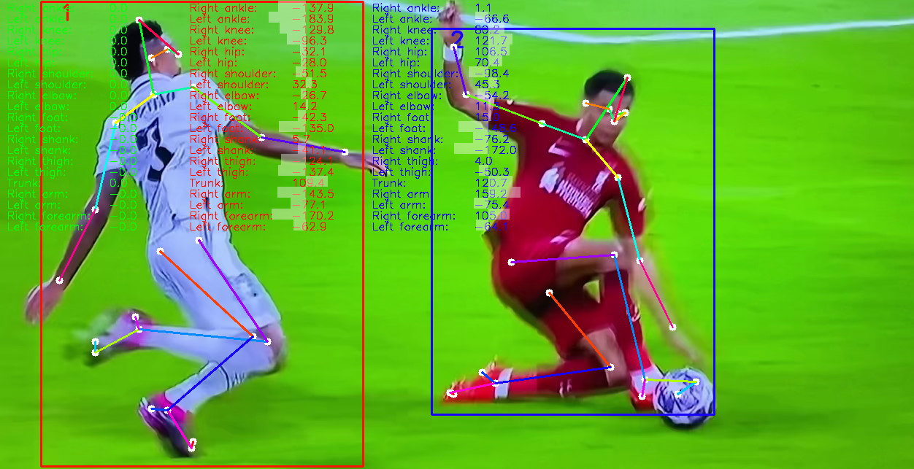
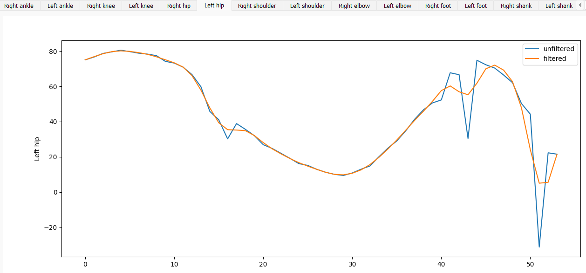

[](https://github.com/davidpagnon/sports2d/actions/workflows/continuous-integration.yml)
[](https://badge.fury.io/py/Sports2D)\
[](https://pepy.tech/project/sports2d)
[](https://github.com/davidpagnon/sports2d/issues)
[](https://GitHub.com/davidpagnon/sports2d/issues?q=is%3Aissue+is%3Aclosed)\
[](https://zenodo.org/doi/10.5281/zenodo.7903962)
[](https://opensource.org/licenses/BSD-3-Clause)


[](https://bit.ly/Sports2D_Colab)

<!-- [](https://github.com/davidpagnon/sports2d/stargazers)
[](https://github.com/davidpagnon/sports2d/issues)
[](https://GitHub.com/davidpagnon/sports2d/issues?q=is%3Aissue+is%3Aclosed) 
[](https://joss.theoj.org/papers/a31cb207a180f7ac9838d049e3a0de26)
-->


# Sports2D

**`Sports2D` automatically computes 2D joint positions, as well as joint and segment angles from a video.**

</br>

**`Announcement:` \
User-friendly Colab version released! (and latest issues fixed, too)\
Works on any smartphone!**\
[](https://bit.ly/Sports2D_Colab)

**Batch processing enabled: process multiple videos at once!**

</br>



`Warning:` Angle estimation is only as good as the pose estimation algorithm, i.e., it is not perfect.\
`Warning:` Results are acceptable only if the persons move in the 2D plane, from right to left or from left to right.\
If you need research-grade markerless joint kinematics, consider using several cameras, and constraining angles to a biomechanically accurate model. See [Pose2Sim](https://github.com/perfanalytics/pose2sim) for example.\
`Warning:` Google Colab does not follow the European GDPR requirements regarding data privacy. [Install locally](#installation) if this matters.

`Know issue`: Results won't be good with some iPhone videos in portrait mode (unless you are working on Colab). This is solved by priorly converting them with `ffmpeg -i video_input.mov video_output.mp4`, or even more simply with any random online video converter such as https://video-converter.com.


## Contents
1. [Installation and Demonstration](#installation-and-demonstration)
   1. [Installation](#installation)
   2. [Demonstration: Detect pose and compute 2D angles](#demonstration-detect-pose-and-compute-2d-angles)
2. [Go further](#go-further)
   1. [Use on your own videos](#use-on-your-own-videos)
   2. [Use OpenPose for multi-person, more accurate analysis](#use-openpose-for-multi-person-more-accurate-analysis)
   3. [Advanced-settings](#advanced-settings)
   4. [How it works](#how-it-works)
3. [How to cite and how to contribute](#how-to-cite-and-how-to-contribute)


## Installation and Demonstration

### Installation

- OPTION 0: **Use Colab** \
  User-friendly (but full) version, also works on a phone or a tablet.\
  [](https://bit.ly/Sports2D_Colab)\
  YouTube tutorial:\
  <a href = "https://www.youtube.com/watch?v=Er5RpcJ8o1Y"></a>
  


- OPTION 1: **Quick install** \
    Open a terminal. Type `python -V` to make sure python '>=3.7 <=3.11' is installed, and then:
    ``` cmd
    pip install sports2d
    ```

- OPTION 2: **Safer install with Anaconda**\
    Install [Miniconda](https://docs.conda.io/en/latest/miniconda.html):\
    Open an Anaconda prompt and create a virtual environment by typing:
    ``` cmd
    conda create -n Sports2D python=3.10 -y
    conda activate Sports2D
    pip install sports2d
    ```

- OPTION 3: **Build from source and test the last changes**\
     Open a terminal in the directory of your choice and clone the Sports2D repository.
     ``` cmd
     git clone https://github.com/davidpagnon/sports2d.git
     cd sports2d
     pip install .
     ```


### Demonstration: Detect pose and compute 2D angles

If you did the conda install, type `conda activate Sports2D` in the Anaconda prompt. Otherwise, skip to the next line.\
Open a terminal, enter `pip show sports2d`, check sports2d package location. \
Copy this path and go to the Demo folder by typing `cd <path>\Sports2D\Demo`. \
Type `ipython`, and test the following code:
``` python
from Sports2D import Sports2D
Sports2D.detect_pose('Config_demo.toml')
Sports2D.compute_angles('Config_demo.toml')
```




You should obtain a video with the overlaid 2D joint positions, and angle text values. This output is also provided as an image folder.\
You should additionally obtain the same information as time series, stored in .csv files. These files can be opened with any spreadsheet software, or with the Pandas Python library for example.\
In addition, you will get the original OpenPose-like json coordinates files.




## Go further

### Use on your own videos

1. Copy-paste `Config_demo.toml` in the directory of your videos.

2. Open it with any text editor.\
Replace the `video_files` value with the name of your videos.

3. Open a terminal or an Anaconda prompt, type:
   ``` cmd
   cd path/to/video/directory
   conda activate Sports2D &:: skip if you did not install with Anaconda
   ipython
   ```
   ``` python
   from Sports2D import Sports2D
   Sports2D.detect_pose('Config_demo.toml')
   Sports2D.compute_angles('Config_demo.toml')
   ```

*Optionally:* If your videos are not in the same folder as `Config_demo.toml`, specify their location in `video_dir`.\
Similarly, if you launch Sports2D in an other directory, specify the location of the config file this way: `Sports2D.detect_pose(<path_to_Config_demo.toml>)`\
In `pose`, specify the use of BlazePose or OpenPose as joint detectors: this will be detailed in the next section.\
In `compute_angles`, select your angles of interest.


### Use OpenPose for multi-person, more accurate analysis

OpenPose is slower than BlazePose, but usually more accurate. It also allows for the detection of multiple persons, whose indices are consistent across frames. 

1. **Install OpenPose** (instructions [there](https://github.com/CMU-Perceptual-Computing-Lab/openpose/blob/master/doc/installation/0_index.md)). \
*Windows portable demo works fine.*

2. If you want even more accurate results, use the BODY_25B experimental model instead of the standard BODY_25 one. This requires manually [downloading the model](https://github.com/CMU-Perceptual-Computing-Lab/openpose_train/blob/master/experimental_models/README.md). You can optionally download from there the BODY_135 model which will let you compute wrist flexion and hand segment angle, however this will be much slower.

3. In `Config_demo.toml` → `pose.OPENPOSE`, specify your OpenPose model, and the path where you downloaded OpenPose.

*N.B.:* If you want to benefit from the capabilities of OpenPose but do not manage to install it, you can use the `Colab notebook` version.
Note that your data will be sent to the Google servers, which do not follow the European GDPR requirements regarding privacy.
[](https://bit.ly/Sports2D_Colab)



### Advanced settings

1. `Config_demo.toml` → `pose_advanced`: These settings are only taken into account if OpenPose is used.
   1. `load_pose`: If you need to change some settings but have already run a pose estimation, you can set this to `true` in order to not regenerate the json pose files.

   2. `save_vid` and `save_img`: You can choose whether you want to save the resulting video and images. If set to `false`, only pose and angle `.csv` files will be generated.

   3. `interp_gap_smaller_than`: Gaps are interpolated only if they are not too wide.
   
   4. `filter`: `true` or `false`. If `true`, you can choose among `Butterworth`, `Gaussian`, `LOESS`, or `Median`, and specify their parameters.\
   Beware that the appearance of the unfiltered skeleton may not match the filtered coordinates and angles.

   5. `show_plots`: Displays a window with tabs corresponding to the coordinates of each detected point. This may cause Python to crash.

2. `Config_demo.toml` → `compute_angles_advanced`: These settings are taken into account both with BlazePose and OpenPose.
   1. `save_vid` and `save_img`: Cf `pose_advanced`.

   2. `filter`: Cf `pose_advanced`.

   3. `show_plots`: Cf `pose_advanced`.

   

*N.B.:* The settings and results of all analyses are stored int the `logs.txt` file, which can be found in in the sports2d installation folder (`pip show sports2d` to find the path).


### How it works

#### Pose detection:

BlazePose or OpenPose are used to detect joint centers from a video.

- If `BlazePose` is used, only one person can be detected.\
  No interpolation nor filtering options are available. Not plotting available.

- If `OpenPose` is used, multiple persons can be consistently detected across frames. A person is associated to another in the next frame when they are at a small distance.\
  Sequences of missing data are interpolated if they are less than N frames long.\
  Resulting coordinates can be filtered with Butterworth, gaussian, median, or loess filter. They can also be plotted.


#### Angle computation:

Joint and segment angles are computed from csv position files.\
If a person suddenly faces the other way, this change of direction is taken into account.\
Resulting angles can be filtered in the same way as point coordinates, and they can also be plotted.

**Joint angle conventions:**
- Ankle dorsiflexion: Between heel and big toe, and ankle and knee
- Knee flexion: Between hip, knee, and ankle 
- Hip flexion: Between knee, hip, and shoulder
- Shoulder flexion: Between hip, shoulder, and elbow
- Elbow flexion: Between wrist, elbow, and shoulder

**Segment angle conventions:**\
Angles are measured anticlockwise between the horizontal and the segment.
- Foot: Between heel and big toe
- Shank: Between knee and ankle
- Thigh: Between hip and knee
- Arm: Between shoulder and elbow
- Forearm: Between elbow and wrist
- Trunk: Between shoulder midpoint and hip midpoint

## How to cite and how to contribute

### How to cite
If you use Sports2D, please cite [Pagnon, 2023].

     @misc{Pagnon2023,
       author = {Pagnon, David},
       title = {Sports2D - Angles from video},
       year = {2023},
       doi= {10.5281/zenodo.7903963},
       publisher = {GitHub},
       journal = {GitHub repository},
       howpublished = {\url{https://github.com/davidpagnon/Sports2D}},
     }

### How to contribute
I would happily welcome any proposal for new features, code improvement, and more!\
If you want to contribute to Sports2D, please follow [this guide](https://docs.github.com/en/get-started/quickstart/contributing-to-projects) on how to fork, modify and push code, and submit a pull request. I would appreciate it if you provided as much useful information as possible about how you modified the code, and a rationale for why you're making this pull request. Please also specify on which operating system and on which python version you have tested the code.

*Here is a to-do list: feel free to complete it:*
- [x] Compute **segment angles**.
- [x] **Multi-person** detection, consistent over time.
- [x] **Only interpolate small gaps**.
- [x] **Filtering and plotting tools**.
- [x] Handle sudden **changes of direction**.
- [x] **Colab version** for those who cannot install OpenPose.
- [x] **Colab version** more user-friendly, usable on a smartphone.
- [x] **Batch processing** for the analysis of multiple videos at once.
- [ ] **Convert positions to meters** by providing the distance [between two clicked points](https://stackoverflow.com/questions/74248955/how-to-display-the-coordinates-of-the-points-clicked-on-the-image-in-google-cola)
- [ ] **Implement [AlphaPose](https://github.com/MVIG-SJTU/AlphaPose)** which might be more accurate on broadcasted videos.
- [ ] Perform **Inverse kinematics and dynamics** with OpenSim (cf. [Pose2Sim](https://github.com/perfanalytics/pose2sim), but in 2D). Update [this model](https://github.com/davidpagnon/Sports2D/blob/main/Sports2D/Utilities/2D_gait.osim) (add arms, markers, remove muscles and contact spheres). Add pipeline example.
</br>

- [ ] **Track other points and angles** with classic tracking methods (cf. [Kinovea](https://www.kinovea.org/features.html)), or by training a model (cf. [DeepLabCut](https://deeplabcut.github.io/DeepLabCut/README.html)).
- [ ] **Pose refinement**. Click and move badly estimated 2D points. See [DeepLabCut](https://www.youtube.com/watch?v=bEuBKB7eqmk) for inspiration.
- [ ] Add tools for annotating images, undistort them, take perspective into account, etc. (cf. [Kinovea](https://www.kinovea.org/features.html)).
- [ ] Check other methods for sorting people across frames ([STAF](https://github.com/soulslicer/STAF/tree/staf) or [LivePoseTracker](https://github.com/ortegatron/liveposetracker).
- [ ] **GUI applications** for Windows, Mac, and Linux, as well as for Android and iOS (minimal version on mobile device, with only BlazePose). Code with [Kivy](https://kivy.org).
- [ ] **Include OpenPose** in Sports2D executable files. [Dockerize](https://github.com/stanfordnmbl/mobile-gaitlab/blob/master/demo/Dockerfile) it? 
- [ ] Full test on **MacOS**.
