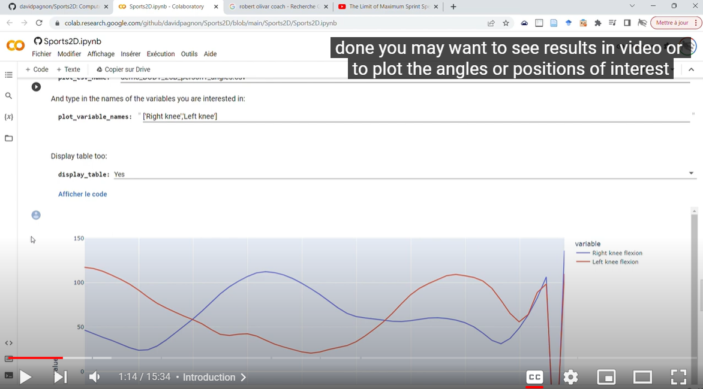
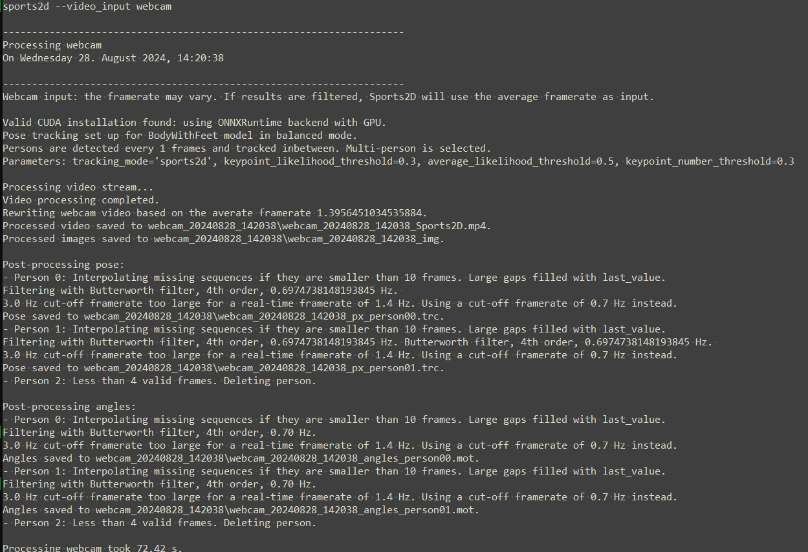
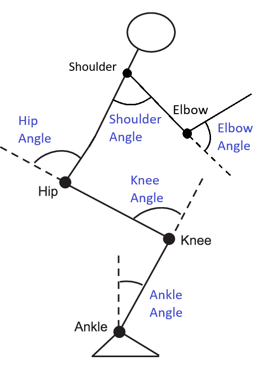

[](https://github.com/davidpagnon/sports2d/actions/workflows/continuous-integration.yml)
[](https://badge.fury.io/py/Sports2D)\
[](https://pepy.tech/project/sports2d)
[](https://github.com/davidpagnon/sports2d/stargazers)
[](https://github.com/davidpagnon/sports2d/issues)
[](https://GitHub.com/davidpagnon/sports2d/issues?q=is%3Aissue+is%3Aclosed)\
[](https://zenodo.org/doi/10.5281/zenodo.7903962)
[](https://opensource.org/licenses/BSD-3-Clause)

<!--[](https://joss.theoj.org/papers/a31cb207a180f7ac9838d049e3a0de26)
-->

<!-- [](https://bit.ly/Sports2D_Colab)-->


# Sports2D

**`Sports2D` automatically computes 2D joint positions, as well as joint and segment angles from a video or a webcam.**

</br>

> **`Announcement:` \
> Complete rewriting of the code!** Run `pip install sports2d -U` to get the latest version.
> - Faster, more accurate
> - Works from a webcam
> - Better visualization output 
> - More flexible, easier to run
> - Batch process multiple videos at once
> 
> Note: Colab version broken for now. I'll fix it in the next few weeks.
<!--User-friendly Colab version released! (and latest issues fixed, too)\
Works on any smartphone!**\
[](https://bit.ly/Sports2D_Colab)-->


</br>

https://github.com/user-attachments/assets/1c6e2d6b-d0cf-4165-864e-d9f01c0b8a0e

`Warning:` Angle estimation is only as good as the pose estimation algorithm, i.e., it is not perfect.\
`Warning:` Results are acceptable only if the persons move in the 2D plane (sagittal or frontal plane). The persons need to be filmed as parallel as possible to the motion plane.\
If you need 3D research-grade markerless joint kinematics, consider using several cameras, and constraining angles to a biomechanically accurate model. See **[Pose2Sim](https://github.com/perfanalytics/pose2sim)** for example.

<!--`Warning:` Google Colab does not follow the European GDPR requirements regarding data privacy. [Install locally](#installation) if this matters.-->

<!--`Know issue`: Results won't be good with some iPhone videos in portrait mode (unless you are working on Colab). This is solved by priorly converting them with `ffmpeg -i video_input.mov video_output.mp4`, or even more simply with any random online video converter such as https://video-converter.com.-->


## Contents
1. [Installation and Demonstration](#installation-and-demonstration)
   1. [Installation](#installation)
   2. [Demonstration](#demonstration)
   3. [Play with the parameters](#play-with-the-parameters)
2. [Go further](#go-further)
   1. [Too slow for you?](#too-slow-for-you)
   2. [What you need is what you get](#what-you-need-is-what-you-get)
   3. [How it works](#how-it-works)
3. [How to cite and how to contribute](#how-to-cite-and-how-to-contribute)

<br>

## Installation and Demonstration

### Installation

<!--- OPTION 0: **Use Colab** \
  User-friendly (but full) version, also works on a phone or a tablet.\
  [](https://bit.ly/Sports2D_Colab)\
  YouTube tutorial:\
  <a href = "https://www.youtube.com/watch?v=Er5RpcJ8o1Y"></a>
  
-->

- OPTION 1: **Quick install** \
    Open a terminal. Type `python -V` to make sure python >=3.8 <=3.11 is installed, and then:
    ``` cmd
    pip install sports2d
    ```

- OPTION 2: **Safer install with Anaconda**\
    Install [Miniconda](https://docs.conda.io/en/latest/miniconda.html):\
    Open an Anaconda prompt and create a virtual environment by typing:
    ``` cmd
    conda create -n Sports2D python=3.9 -y
    conda activate Sports2D
    pip install sports2d
    ```

- OPTION 3: **Build from source and test the last changes**\
     Open a terminal in the directory of your choice and clone the Sports2D repository.
     ``` cmd
     git clone https://github.com/davidpagnon/sports2d.git
     cd sports2d
     pip install .
     ```

<br>

### Demonstration

Just open a command line and run:
``` cmd
sports2d
```

You should see the joint positions and angles being displayed in real time.

Check the folder where you run that command line to find the resulting `video`, `images`, `TRC pose` and `MOT angle` files (which can be opened with any spreadsheet software), and `logs`.

***Important:*** If you ran the conda install, you first need to activate the environment: run `conda activate sports2d` in the Anaconda prompt.




***Note:***\
The Demo video is voluntarily challenging to demonstrate the robustness of the process after sorting, interpolation and filtering. It contains:
- One person walking in the sagittal plane
- One person doing jumping jacks in the frontal plane. This person then performs a flip while being backlit, both of which are challenging for the pose detection algorithm
- One tiny person flickering in the background who needs to be ignored

<br>

### Play with the parameters

For a full list of the available parameters, check the [Config_Demo.toml](https://github.com/davidpagnon/Sports2D/blob/main/Sports2D/Demo/Config_demo.toml) file or type:
``` cmd
sports2d --help
```
<br>

- Run on custom video with default parameters:
  ``` cmd
  sports2d --video_input path_to_video.mp4
  ```
- Run on multiple videos with default parameters:
  ``` cmd
  sports2d --video_input path_to_video1.mp4 path_to_video2.mp4
  ```
- Run on webcam with default parameters: 
  ``` cmd
  sports2d --video_input webcam
  ```
- Run with custom parameters (all non specified are set to default): 
  ``` cmd
  sports2d --show_graphs False --time_range 0 2.1 --result_dir path_to_result_dir
  ```
  ``` cmd
  sports2d --multiperson false --mode lightweight --det_frequency 50
  ```
- Run with a toml configuration file: 
  ``` cmd
  sports2d --config path_to_config.toml
  ```
- Run within a Python script: 
  ``` python
  from Sports2D import Sports2D; Sports2D.process('Config_demo.toml')
  ```

<br>

## Go further

### Too slow for you?

**Quick fixes:**
- Use `--multiperson false`: Can be used if one single person is present in the video. Otherwise, persons' IDs may be mixed up.
- Use `--mode lightweight`: Will use a lighter version of RTMPose, which is faster but less accurate.
- Use `--det_frequency 50`: Will detect poses only every 50 frames, and track keypoints inbetween, which is faster.

<br> 

**Use your GPU**:\
Will be much faster, with no impact on accuracy. However, the installation takes about 6 GB of additional storage space.

1. Run `nvidia-smi` in a terminal. If this results in an error, your GPU is probably not compatible with CUDA. If not, note the "CUDA version": it is the latest version your driver is compatible with (more information [on this post](https://stackoverflow.com/questions/60987997/why-torch-cuda-is-available-returns-false-even-after-installing-pytorch-with)).

   Then go to the [ONNXruntime requirement page](https://onnxruntime.ai/docs/execution-providers/CUDA-ExecutionProvider.html#requirements), note the latest compatible CUDA and cuDNN requirements. Next, go to the [pyTorch website](https://pytorch.org/get-started/previous-versions/) and install the latest version that satisfies these requirements (beware that torch 2.4 ships with cuDNN 9, while torch 2.3 installs cuDNN 8). For example:
   ``` cmd
   pip3 install torch torchvision torchaudio --index-url https://download.pytorch.org/whl/cu124
   ```

<!-- > ***Note:*** Issues were reported with the default command. However, this has been tested and works:
`pip install torch==2.3.1 torchvision==0.18.1 torchaudio==2.3.1 --index-url https://download.pytorch.org/whl/cu118` -->

2. Finally, install ONNX Runtime with GPU support:
   ```
   pip install onnxruntime-gpu
   ```

3. Check that everything went well within Python with these commands:
   ``` bash
   python -c 'import torch; print(torch.cuda.is_available())'
   python -c 'import onnxruntime as ort; print(ort.get_available_providers())'
   # Should print "True ['CUDAExecutionProvider', ...]"
   ```
   <!-- print(f'torch version: {torch.__version__}, cuda version: {torch.version.cuda}, cudnn version: {torch.backends.cudnn.version()}, onnxruntime version: {ort.__version__}') -->

<br>

### What you need is what you get
- Choose whether you want video, images, trc pose file, and angle mot file. For example:
  ```cmd
  sports2d --save_vid false --save_img true --save_trc false --save_mot true
  ```
- Choose which angles you needfile. For example:
  ```cmd
  sports2d --joint_angles 'right knee' 'left knee' --segment_angles None
  ```
- Choose where to display the angles: either as a list on the upper-left of the image, or near the joint/segment, or bothfile. For example:
  ```cmd
  sports2d --display_angle_values_on body
  ```
- Choose where to save the resultsfile. For example:
  ```cmd
  sports2d --result_dir path_to_result_dir
  ```
- Choose a fraction of the video to analyze (in seconds)file. For example:
  ```cmd
  sports2d --time_range 0 2.1
  ```

<br>

### How it works

Sports2D:
- Detects 2D joint centers from a video or a webcam with RTMLib.
- Computes selected joint and segment angles. 
- Optionally saves processed image files and video file. Optionally saves processed poses as a TRC file, and angles as a MOT file (OpenSim compatible).

<br>

**Okay but how does it work, really?**\
Sports2D:
1. Reads stream from a webcam, from one video, or from a list of videos. Selects the specified time range to process.
2. Sets up the RTMLib pose tracker from RTMlib with specified parameters. It can be run in lightweight, balanced, or performance mode, and for faster inference, keypoints can be tracked for a certain number of frames instead of detected. Any RTMPose model can be used. 
3. Tracks people so that their IDs are consistent across frames. A person is associated to another in the next frame when they are at a small distance. IDs remain consistent even if the person disappears from a few frames. This carefully crafted `sports2d` tracker runs at a comparable speed as the RTMlib one but is much more robust. The user can still choose the RTMLib method if they need it by specifying it in the Config.toml file. .
4. Retrieves the keypoints with high enough confidence, and only keeps the persons with enough average high-confidence.
5. Computes the selected joint and segment angles, and flips them on the left/right side if the respective foot is pointing to the left/right. 
5. Draws bounding boxes around each person and writes their IDs\
  Draws the skeleton and the keypoints, with a green to red color scale to account for their confidence\
  Draws joint and segment angles on the body, and writes the values either near the joint/segment, or on the upper-left of the image with a progress bar
6. Interpolates missing pose and angle sequences if gaps are not too large. Filters them with the selected filter (among `Butterworth`, `Gaussian`, `LOESS`, or `Median`) and their parameters
7. Optionally show processed images, saves them, or saves them as a video\
  Optionally plots pose and angle data before and after processing for comparison\
  Optionally saves poses for each person as a TRC file, and angles as a MOT file 

<br>

**Joint angle conventions:**
- Ankle dorsiflexion: Between heel and big toe, and ankle and knee.\
  *-90° when the foot is aligned with the shank.*
- Knee flexion: Between hip, knee, and ankle.\
  *0° when the shank is aligned with the thigh.*
- Hip flexion: Between knee, hip, and shoulder.\
  *0° when the trunk is aligned with the thigh.* 
- Shoulder flexion: Between hip, shoulder, and elbow.\
  *180° when the arm is aligned with the trunk.*
- Elbow flexion: Between wrist, elbow, and shoulder.\
  *0° when the forearm is aligned with the arm.*

**Segment angle conventions:**\
Angles are measured anticlockwise between the horizontal and the segment.
- Foot: Between heel and big toe
- Shank: Between ankle and knee
- Thigh: Between hip and knee
- Pelvis: Between left and right hip
- Trunk: Between hip midpoint and shoulder midpoint
- Shoulders: Between left and right shoulder
- Head: Between neck and top of the head
- Arm: Between shoulder and elbow
- Forearm: Between elbow and wrist




<br> 

## How to cite and how to contribute

### How to cite
If you use Sports2D, please cite [Pagnon, 2023].

     @misc{Pagnon2023,
       author = {Pagnon, David},
       title = {Sports2D - Angles from video},
       year = {2023},
       doi= {10.5281/zenodo.7903963},
       publisher = {GitHub},
       journal = {GitHub repository},
       howpublished = {\url{https://github.com/davidpagnon/Sports2D}},
     }

### How to contribute
I would happily welcome any proposal for new features, code improvement, and more!\
If you want to contribute to Sports2D, please follow [this guide](https://docs.github.com/en/get-started/quickstart/contributing-to-projects) on how to fork, modify and push code, and submit a pull request. I would appreciate it if you provided as much useful information as possible about how you modified the code, and a rationale for why you're making this pull request. Please also specify on which operating system and on which python version you have tested the code.

*Here is a to-do list: feel free to complete it:*
- [x] Compute **segment angles**.
- [x] **Multi-person** detection, consistent over time.
- [x] **Only interpolate small gaps**.
- [x] **Filtering and plotting tools**.
- [x] Handle sudden **changes of direction**.
- [x] **Batch processing** for the analysis of multiple videos at once.
- [ ] **Colab version**: more user-friendly, usable on a smartphone.
- [ ] **GUI applications** for Windows, Mac, and Linux, as well as for Android and iOS.
- [ ] **Convert positions to meters** by providing the distance [between two clicked points](https://stackoverflow.com/questions/74248955/how-to-display-the-coordinates-of-the-points-clicked-on-the-image-in-google-cola)
- [ ] Perform **Inverse kinematics and dynamics** with OpenSim (cf. [Pose2Sim](https://github.com/perfanalytics/pose2sim), but in 2D). Update [this model](https://github.com/davidpagnon/Sports2D/blob/main/Sports2D/Utilities/2D_gait.osim) (add arms, markers, remove muscles and contact spheres). Add pipeline example.
</br>

- [ ] **Track other points and angles** with classic tracking methods (cf. [Kinovea](https://www.kinovea.org/features.html)), or by training a model (cf. [DeepLabCut](https://deeplabcut.github.io/DeepLabCut/README.html)).
- [ ] **Pose refinement**. Click and move badly estimated 2D points. See [DeepLabCut](https://www.youtube.com/watch?v=bEuBKB7eqmk) for inspiration.
- [ ] Add tools for annotating images, undistort them, take perspective into account, etc. (cf. [Kinovea](https://www.kinovea.org/features.html)).

