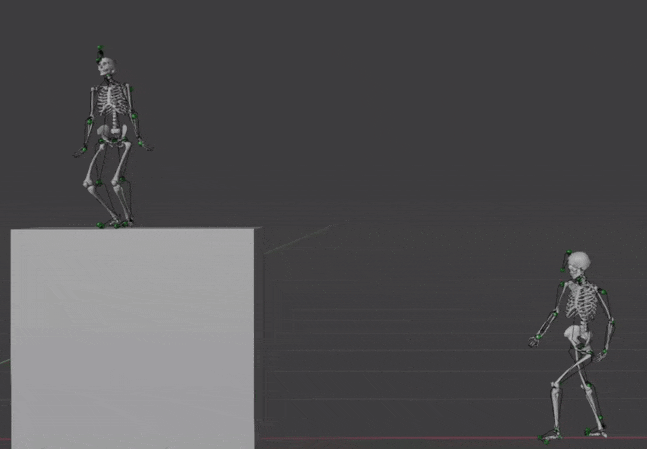
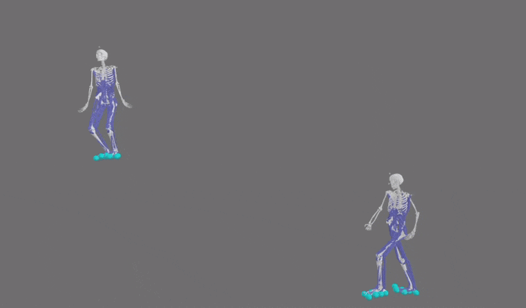
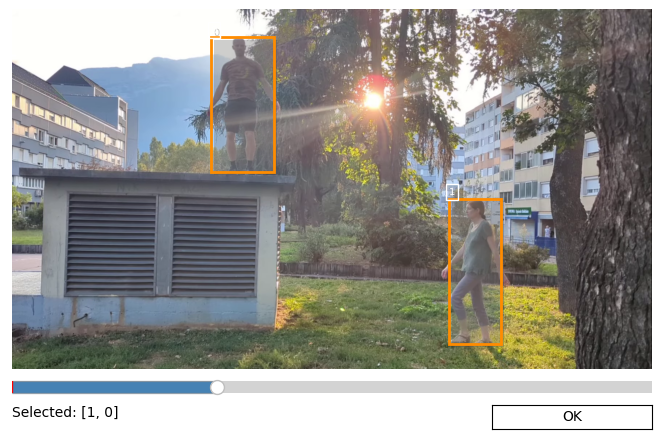

[](https://github.com/davidpagnon/sports2d/actions/workflows/continuous-integration.yml)
[](https://badge.fury.io/py/Sports2D)
\
[](https://pepy.tech/project/sports2d)
[](https://github.com/davidpagnon/sports2d/stargazers)
[](https://github.com/davidpagnon/sports2d/issues)
[](https://GitHub.com/davidpagnon/sports2d/issues?q=is%3Aissue+is%3Aclosed)
\
[](https://joss.theoj.org/papers/1d525bbb2695c88c6ebbf2297bd35897)
[](https://zenodo.org/doi/10.5281/zenodo.7903962)
[](https://opensource.org/licenses/BSD-3-Clause)
\
[](https://discord.com/invite/4mXUdSFjmt)

<!-- [](https://bit.ly/Sports2D_Colab)-->


# Sports2D

**`Sports2D` automatically computes 2D joint positions, as well as joint and segment angles from a video or a webcam.**

</br>

> **`Announcements:`**
> - Select only the persons you want to analyze **New in v0.8!** 
> - MarkerAugmentation and Inverse Kinematics for accurate 3D motion with OpenSim. **New in v0.7!** 
> - Any detector and pose estimation model can be used. **New in v0.6!**
> - Results in meters rather than pixels. **New in v0.5!**
> - Faster, more accurate
> - Works from a webcam
> - Better visualization output 
> - More flexible, easier to run
>
> Run `pip install sports2d pose2sim -U` to get the latest version.

***N.B.:*** As always, I am more than happy to welcome contributions (see [How to contribute](#how-to-contribute-and-to-do-list))!
<!--User-friendly Colab version released! (and latest issues fixed, too)\
Works on any smartphone!**\
[](https://bit.ly/Sports2D_Colab)-->


</br>


https://github.com/user-attachments/assets/6a444474-4df1-4134-af0c-e9746fa433ad

<!-- https://github.com/user-attachments/assets/1c6e2d6b-d0cf-4165-864e-d9f01c0b8a0e -->

`Warning:` Angle estimation is only as good as the pose estimation algorithm, i.e., it is not perfect.\
`Warning:` Results are acceptable only if the persons move in the 2D plane (sagittal or frontal plane). The persons need to be filmed as parallel as possible to the motion plane.\
If you need 3D research-grade markerless joint kinematics, consider using several cameras with **[Pose2Sim](https://github.com/perfanalytics/pose2sim)**.

<!--`Warning:` Google Colab does not follow the European GDPR requirements regarding data privacy. [Install locally](#installation) if this matters.-->

<!--`Know issue`: Results won't be good with some iPhone videos in portrait mode (unless you are working on Colab). This is solved by priorly converting them with `ffmpeg -i video_input.mov video_output.mp4`, or even more simply with any random online video converter such as https://video-converter.com.-->


## Contents
1. [Installation and Demonstration](#installation-and-demonstration)
   1. [Installation](#installation)
      1. [Quick install](#quick-install)
      2. [Full install](#full-install)
   2. [Demonstration](#demonstration)
      1. [Run the demo](#run-the-demo)
      2. [Visualize in OpenSim](#visualize-in-opensim)
      3. [Visualize in Blender](#visualize-in-blender)
   3. [Play with the parameters](#play-with-the-parameters)
      1. [Run on a custom video or on a webcam](#run-on-a-custom-video-or-on-a-webcam)
      2. [Run for a specific time range](#run-for-a-specific-time-range)
      3. [Select the persons you are interested in](#select-the-persons-you-are-interested-in)
      4. [Get coordinates in meters](#get-coordinates-in-meters)
      5. [Run inverse kinematics](#run-inverse-kinematics)
      6. [Run on several videos at once](#run-on-several-videos-at-once)
      7. [Use the configuration file or run within Python](#use-the-configuration-file-or-run-within-python)
      8. [Get the angles the way you want](#get-the-angles-the-way-you-want)
      9. [Customize your output](#customize-your-output)
      10. [Use a custom pose estimation model](#use-a-custom-pose-estimation-model)
      11. [All the parameters](#all-the-parameters)
2. [Go further](#go-further)
   1. [Too slow for you?](#too-slow-for-you)
   3. [Run inverse kinematics](#run-inverse-kinematics)
   4. [How it works](#how-it-works)
3. [How to cite and how to contribute](#how-to-cite-and-how-to-contribute)

<br>

## Installation and Demonstration

### Installation

<!--- OPTION 0: **Use Colab** \
  User-friendly (but full) version, also works on a phone or a tablet.\
  [](https://bit.ly/Sports2D_Colab)\
  YouTube tutorial:\
  <a href = "https://www.youtube.com/watch?v=Er5RpcJ8o1Y"></a>
  
-->

#### Quick install

> N.B.: Full install is required for OpenSim inverse kinematics.

Open a terminal. Type `python -V` to make sure python >=3.10 <=3.11 is installed. If not, install it [from there](https://www.python.org/downloads/). 

Run:
``` cmd
pip install sports2d
```

Alternatively, build from source to test the last changes:
``` cmd
git clone https://github.com/davidpagnon/sports2d.git
cd sports2d
pip install .
```

<br>

#### Full install

> Only needed if you want to run inverse kinematics (`--do_ik True`).

- Install Anaconda or [Miniconda](https://docs.conda.io/en/latest/miniconda.html):\
  Open an Anaconda prompt and create a virtual environment:
  ``` cmd
  conda create -n Sports2D python=3.10 -y
  conda activate Sports2D
  ```
- **Install OpenSim**:\
  Install the OpenSim Python API (if you do not want to install via conda, refer [to this page](https://opensimconfluence.atlassian.net/wiki/spaces/OpenSim/pages/53085346/Scripting+in+Python#ScriptinginPython-SettingupyourPythonscriptingenvironment(ifnotusingconda))):
    ```
    conda install -c opensim-org opensim -y
    ```
   
- **Install Sports2D with Pose2Sim**:
  ``` cmd
  pip install sports2d
  ```


<br>

### Demonstration

#### Run the demo:

Just open a command line and run:
``` cmd
sports2d
```

You should see the joint positions and angles being displayed in real time.

Check the folder where you run that command line to find the resulting `video`, `images`, `TRC pose` and `MOT angle` files (which can be opened with any spreadsheet software), and `logs`.

***Important:*** If you ran the conda install, you first need to activate the environment: run `conda activate sports2d` in the Anaconda prompt.


***Note:***\
The Demo video is voluntarily challenging to demonstrate the robustness of the process after sorting, interpolation and filtering. It contains:
- One person walking in the sagittal plane
- One person doing jumping jacks in the frontal plane. This person then performs a flip while being backlit, both of which are challenging for the pose detection algorithm
- One tiny person flickering in the background who needs to be ignored

<br>


#### Visualize in Blender

1. **Install the Pose2Sim_Blender add-on.**\
   Follow instructions on the [Pose2Sim_Blender](https://github.com/davidpagnon/Pose2Sim_Blender) add-on page.
2. **Open your point coordinates.**\
   **Add Markers**: open your trc file(e.g., `coords_m.trc`) from your `result_dir` folder.
   
   This will optionally create **an animated rig** based on the motion of the captured person.
3. **Open your animated skeleton:**\
   Make sure you first set `--do_ik True` ([full install](#full-install) required). See [inverse kinematics](#run-inverse-kinematics) section for more details.
   - **Add Model**: Open your scaled model (e.g., `Model_Pose2Sim_LSTM.osim`). 
   - **Add Motion**: Open your motion file (e.g., `angles.mot`). Make sure the skeleton is selected in the outliner.

   The OpenSim skeleton is not rigged yet. **[Feel free to contribute!](https://github.com/perfanalytics/pose2sim/issues/40)**



<br>


#### Visualize in OpenSim

1. Install **[OpenSim GUI](https://simtk.org/frs/index.php?group_id=91)**.
2. **Visualize point coordinates:**\
   **File -> Preview experimental data:** Open your trc file (e.g., `coords_m.trc`) from your `result_dir` folder.
3. **Visualize angles:**\
   To open an animated model and run further biomechanical analysis, make sure you first set `--do_ik True` ([full install](#full-install) required). See [inverse kinematics](#run-inverse-kinematics) section for more details. 
   - **File -> Open Model:** Open your scaled model (e.g., `Model_Pose2Sim_LSTM.osim`).
   - **File -> Load Motion:** Open your motion file (e.g., `angles.mot`).



<br>


### Play with the parameters

For a full list of the available parameters, see [this section](#all-the-parameters) of the documentation, check the [Config_Demo.toml](https://github.com/davidpagnon/Sports2D/blob/main/Sports2D/Demo/Config_demo.toml) file, or type `sports2d --help`. All non specified are set to default values.

<br>


#### Run on a custom video or on a webcam:
``` cmd
sports2d --video_input path_to_video.mp4
```

``` cmd
sports2d --video_input webcam
```

<br>

#### Run for a specific time range:
```cmd
sports2d --time_range 1.2 2.7
```
 
<br>


#### Select the persons you are interested in:
If you only want to analyze a subset of the detected persons, you can use the `--nb_persons_to_detect` and `--person_ordering_method` parameters. The order matters if you want to [convert coordinates in meters](#get-coordinates-in-meters) or [run inverse kinematics](#run-inverse-kinematics). 


``` cmd
sports2d --nb_persons_to_detect 2 --person_ordering_method highest_likelihood
```

We recommend to use the `on_click` method if you can afford a manual input. This lets the user handle both the person number and their order in the same stage. When prompted, select the persons you are interested in in the desired order. In our case, lets slide to a frame where both people are visible, and select the woman first, then the man.

Otherwise, if you want to run Sports2D automatically for example, you can choose other ordering methods such as 'highest_likelihood', 'largest_size', 'smallest_size',  'greatest_displacement', 'least_displacement', 'first_detected', or 'last_detected'.

``` cmd
sports2d --person_ordering_method on_click
```





<br>


#### Get coordinates in meters: 
> **N.B.:** Depth is estimated from a neutral pose. 

<!-- You either need to provide a calibration file, or simply the height of a person (Note that the latter will not take distortions into account, and that it will be less accurate for motion in the frontal plane).\-->
You may need to convert pixel coordinates to meters.\
Just provide the height of the reference person (and their ID in case of multiple person detection).

You can also specify whether the visible side of the person is left, right, front, or back. Set it to 'auto' if you do not want to find it automatically (only works for motion in the sagittal plane), or to 'none' if you want to keep 2D instead of 3D coordinates (if the person goes right, and then left for example).

The floor angle and the origin of the xy axis are computed automatically from gait. If you analyze another type of motion, you can manually specify them. Note that `y` points down.\
Also note that distortions are not taken into account, and that results will be less accurate for motions in the frontal plane.

<!-- ``` cmd
sports2d --to_meters True --calib_file calib_demo.toml
``` -->
``` cmd
sports2d --to_meters True --first_person_height 1.65 --visible_side auto front none
```
``` cmd
sports2d --to_meters True --first_person_height 1.65 --visible_side auto front none `
         --person_ordering_method on_click `
         --floor_angle 0 --xy_origin 0 940
```

<br>


#### Run inverse kinematics:
> N.B.: [Full install](#full-install) required.

> **N.B.:** The person needs to be moving on a single plane for the whole selected time range.

OpenSim inverse kinematics allows you to set joint constraints, joint angle limits, to constrain the bones to keep the same length all along the motion and potentially to have equal sizes on left and right side. Most generally, it gives more biomechanically accurate results. It can also give you the opportunity to compute joint torques, muscle forces, ground reaction forces, and more, [with MoCo](https://opensim-org.github.io/opensim-moco-site/) for example.

This is done via [Pose2Sim](https://github.com/perfanalytics/pose2sim).\
Model scaling is done according to the mean of the segment lengths, across a subset of frames. We remove the 10% fastest frames (potential outliers), the frames where the speed is 0 (person probably out of frame), the frames where the average knee and hip flexion angles are above 45° (pose estimation is not precise when the person is crouching) and the 20% most extreme segment values after the previous operations (potential outliers). All these parameters can be edited in your Config.toml file.

```cmd
sports2d --time_range 1.2 2.7 `
         --do_ik true --first_person_height 1.65 --visible_side auto front
```

You can optionally use the LSTM marker augmentation to improve the quality of the output motion.\
You can also optionally give the participants proper masses. Mass has no influence on motion, only on forces (if you decide to further pursue kinetics analysis).

```cmd
sports2d --time_range 1.2 2.7 `
         --do_ik true --first_person_height 1.65 --visible_side left front `
         --use_augmentation True --participant_mass 55.0 67.0
```

<br>


#### Run on several videos at once:
``` cmd
sports2d --video_input demo.mp4 other_video.mp4
```
All videos analyzed with the same time range.
```cmd
sports2d --video_input demo.mp4 other_video.mp4 --time_range 1.2 2.7
```
Different time ranges for each video.
```cmd
sports2d --video_input demo.mp4 other_video.mp4 --time_range 1.2 2.7 0 3.5
```

<br>


#### Use the configuration file or run within Python:

- Run with a configuration file:
  ``` cmd
  sports2d --config Config_demo.toml
  ```
- Run within Python: 
  ``` python
  from Sports2D import Sports2D; Sports2D.process('Config_demo.toml')
  ```
- Run within Python with a dictionary (for example, `config_dict = toml.load('Config_demo.toml')`):
  ``` python
  from Sports2D import Sports2D; Sports2D.process(config_dict)
  ```

<br>


#### Get the angles the way you want:

- Choose which angles you need:
  ```cmd
  sports2d --joint_angles 'right knee' 'left knee' --segment_angles None
  ```
- Choose where to display the angles: either as a list on the upper-left of the image, or near the joint/segment, or both:
  ```cmd
  sports2d --display_angle_values_on body # OR none, or list
  ```
- You can also decide not to calculate and display angles at all:
  ```cmd
  sports2d --calculate_angles false
  ```
- To run **inverse kinematics with OpenSim**, check [this section](#run-inverse-kinematics)

<br>


#### Customize your output:
- Choose whether you want video, images, trc pose file, angle mot file, real-time display, and plots:
  ```cmd
  sports2d --save_vid false --save_img true `
           --save_pose false --save_angles true `
           --show_realtime_results false --show_graphs false
  ```
- Save results to a custom directory, specify the slow-motion factor:
  ``` cmd
  sports2d --result_dir path_to_result_dir
  ```

<br>


#### Use a custom pose estimation model:
- Retrieve hand motion:
  ``` cmd
  sports2d --pose_model WholeBody 
  ```
- Use any custom (deployed) MMPose model
  ``` cmd
  sports2d --pose_model BodyWithFeet : `
           --mode """{'det_class':'YOLOX', `
                  'det_model':'https://download.openmmlab.com/mmpose/v1/projects/rtmposev1/onnx_sdk/yolox_m_8xb8-300e_humanart-c2c7a14a.zip', `
                  'det_input_size':[640, 640], `
                  'pose_class':'RTMPose', `
                  'pose_model':'https://download.openmmlab.com/mmpose/v1/projects/rtmposev1/onnx_sdk/rtmpose-m_simcc-body7_pt-body7-halpe26_700e-256x192-4d3e73dd_20230605.zip', `
                  'pose_input_size':[192,256]}"""
  ```

<br>


#### All the parameters

For a full list of the available parameters, have a look at the [Config_Demo.toml](https://github.com/davidpagnon/Sports2D/blob/main/Sports2D/Demo/Config_demo.toml) file or type:

``` cmd
sports2d --help
```

``` 
'config': ["C", "path to a toml configuration file"],

'video_input': ["i", "webcam, or video_path.mp4, or video1_path.avi video2_path.mp4 ... Beware that images won't be saved if paths contain non ASCII characters"],
'nb_persons_to_detect': ["n", "number of persons to detect. int or 'all'. 'all' if not specified"],
'person_ordering_method': ["", "'on_click', 'highest_likelihood', 'largest_size', 'smallest_size', 'greatest_displacement', 'least_displacement', 'first_detected', or 'last_detected'. 'on_click' if not specified"],
'first_person_height': ["H", "height of the reference person in meters. 1.65 if not specified. Not used if a calibration file is provided"],
'visible_side': ["", "front, back, left, right, auto, or none. 'auto front none' if not specified. If 'auto', will be either left or right depending on the direction of the motion. If 'none', no IK for this person"],
'load_trc_px': ["", "load trc file to avaid running pose estimation again. false if not specified"],
'compare': ["", "visually compare motion with trc file. false if not specified"],
'webcam_id': ["w", "webcam ID. 0 if not specified"],
'time_range': ["t", "start_time end_time. In seconds. Whole video if not specified. start_time1 end_time1 start_time2 end_time2 ... if multiple videos with different time ranges"],
'video_dir': ["d", "current directory if not specified"],
'result_dir': ["r", "current directory if not specified"],
'show_realtime_results': ["R", "show results in real-time. true if not specified"],
'display_angle_values_on': ["a", '"body", "list", "body" "list", or "none". body list if not specified'],
'show_graphs': ["G", "show plots of raw and processed results. true if not specified"],
'joint_angles': ["j", '"Right ankle" "Left ankle" "Right knee" "Left knee" "Right hip" "Left hip" "Right shoulder" "Left shoulder" "Right elbow" "Left elbow" if not specified'],
'segment_angles': ["s", '"Right foot" "Left foot" "Right shank" "Left shank" "Right thigh" "Left thigh" "Pelvis" "Trunk" "Shoulders" "Head" "Right arm" "Left arm" "Right forearm" "Left forearm" if not specified'],
'save_vid': ["V", "save processed video. true if not specified"],
'save_img': ["I", "save processed images. true if not specified"],
'save_pose': ["P", "save pose as trc files. true if not specified"],
'calculate_angles': ["c", "calculate joint and segment angles. true if not specified"],
'save_angles': ["A", "save angles as mot files. true if not specified"],
'slowmo_factor': ["", "slow-motion factor. For a video recorded at 240 fps and exported to 30 fps, it would be 240/30 = 8. 1 if not specified"],
'pose_model': ["p", "only body_with_feet is available for now. body_with_feet if not specified"],
'mode': ["m", 'light, balanced, performance, or a """{dictionary within triple quote}""". balanced if not specified. Use a dictionary to specify your own detection and/or pose estimation models (more about in the documentation).'],
'det_frequency': ["f", "run person detection only every N frames, and inbetween track previously detected bounding boxes. keypoint detection is still run on all frames.\n\
                  Equal to or greater than 1, can be as high as you want in simple uncrowded cases. Much faster, but might be less accurate. 1 if not specified: detection runs on all frames"],
'backend': ["", "Backend for pose estimation can be 'auto', 'cpu', 'cuda', 'mps' (for MacOS), or 'rocm' (for AMD GPUs)"],
'device': ["", "Device for pose estimatino can be 'auto', 'openvino', 'onnxruntime', 'opencv'"],
'to_meters': ["M", "convert pixels to meters. true if not specified"],
'make_c3d': ["", "Convert trc to c3d file. true if not specified"],
'floor_angle': ["", "angle of the floor (degrees). 'auto' if not specified"],
'xy_origin': ["", "origin of the xy plane. 'auto' if not specified"],
'calib_file': ["", "path to calibration file. '' if not specified, eg no calibration file"],
'save_calib': ["", "save calibration file. true if not specified"],
'do_ik': ["", "do inverse kinematics. false if not specified"],
'use_augmentation': ["", "Use LSTM marker augmentation. false if not specified"],
'use_contacts_muscles': ["", "Use model with contact spheres and muscles. false if not specified"],
'participant_mass': ["", "mass of the participant in kg or none. Defaults to 70 if not provided. No influence on kinematics (motion), only on kinetics (forces)"],
'close_to_zero_speed_m': ["","Sum for all keypoints: about 50 px/frame or 0.2 m/frame"], 
'tracking_mode': ["", "'sports2d' or 'deepsort'. 'deepsort' is slower, harder to parametrize but can be more robust if correctly tuned"],
'deepsort_params': ["", 'Deepsort tracking parameters: """{dictionary between 3 double quotes}""". \n\
                    Default: max_age:30, n_init:3, nms_max_overlap:0.8, max_cosine_distance:0.3, nn_budget:200, max_iou_distance:0.8, embedder_gpu: True\n\
                    More information there: https://github.com/levan92/deep_sort_realtime/blob/master/deep_sort_realtime/deepsort_tracker.py#L51'],
'input_size': ["", "width, height. 1280, 720 if not specified. Lower resolution will be faster but less precise"],
'keypoint_likelihood_threshold': ["", "detected keypoints are not retained if likelihood is below this threshold. 0.3 if not specified"],
'average_likelihood_threshold': ["", "detected persons are not retained if average keypoint likelihood is below this threshold. 0.5 if not specified"],
'keypoint_number_threshold': ["", "detected persons are not retained if number of detected keypoints is below this threshold. 0.3 if not specified, i.e., i.e., 30 percent"],
'fastest_frames_to_remove_percent': ["", "Frames with high speed are considered as outliers. Defaults to 0.1"],
'close_to_zero_speed_px': ["", "Sum for all keypoints: about 50 px/frame or 0.2 m/frame. Defaults to 50"],
'large_hip_knee_angles': ["", "Hip and knee angles below this value are considered as imprecise. Defaults to 45"],
'trimmed_extrema_percent': ["", "Proportion of the most extreme segment values to remove before calculating their mean. Defaults to 50"],
'fontSize': ["", "font size for angle values. 0.3 if not specified"],
'flip_left_right': ["", "true or false. Flips angles when the person faces the other side. The person looks to the right if their toe keypoint is to the right of their heel. Set it to false if the person is sprinting or if you want timeseries to be continuous even when the participent switches their stance. true if not specified"],
'correct_segment_angles_with_floor_angle': ["", "true or false. If the camera is tilted, corrects segment angles as regards to the floor angle. Set to false is the floor is tilted instead. True if not specified"],
'interpolate': ["", "interpolate missing data. true if not specified"],
'interp_gap_smaller_than': ["", "interpolate sequences of missing data if they are less than N frames long. 10 if not specified"],
'fill_large_gaps_with': ["", "last_value, nan, or zeros. last_value if not specified"],
'filter': ["", "filter results. true if not specified"],
'filter_type': ["", "butterworth, gaussian, median, or loess. butterworth if not specified"],
'order': ["", "order of the Butterworth filter. 4 if not specified"],
'cut_off_frequency': ["", "cut-off frequency of the Butterworth filter. 3 if not specified"],
'sigma_kernel': ["", "sigma of the gaussian filter. 1 if not specified"],
'nb_values_used': ["", "number of values used for the loess filter. 5 if not specified"],
'kernel_size': ["", "kernel size of the median filter. 3 if not specified"],
'osim_setup_path': ["", "path to OpenSim setup. '../OpenSim_setup' if not specified"],
'right_left_symmetry': ["", "right left symmetry. true if not specified"],
'default_height': ["", "default height for scaling. 1.70 if not specified"],
'remove_individual_scaling_setup': ["", "remove individual scaling setup files generated during scaling. true if not specified"],
'remove_individual_ik_setup': ["", "remove individual IK setup files generated during IK. true if not specified"],
'fastest_frames_to_remove_percent': ["", "Frames with high speed are considered as outliers. Defaults to 0.1"],
'close_to_zero_speed_m': ["","Sum for all keypoints: about 0.2 m/frame. Defaults to 0.2"],
'close_to_zero_speed_px': ["", "Sum for all keypoints: about 50 px/frame. Defaults to 50"],
'large_hip_knee_angles': ["", "Hip and knee angles below this value are considered as imprecise and ignored. Defaults to 45"],
'trimmed_extrema_percent': ["", "Proportion of the most extreme segment values to remove before calculating their mean. Defaults to 50"],
'use_custom_logging': ["", "use custom logging. false if not specified"]
```

<br>


## Go further

### Too slow for you?

**Quick fixes:**
- Use ` --save_vid false --save_img false --show_realtime_results false`: Will not save images or videos, and will not display the results in real time. 
- Use `--mode lightweight`: Will use a lighter version of RTMPose, which is faster but less accurate.\
Note that any detection and pose models can be used (first [deploy them with MMPose](https://mmpose.readthedocs.io/en/latest/user_guides/how_to_deploy.html#onnx) if you do not have their .onnx or .zip files), with the following formalism:
  ```
  --mode """{'det_class':'YOLOX',
          'det_model':'https://download.openmmlab.com/mmpose/v1/projects/rtmposev1/onnx_sdk/yolox_nano_8xb8-300e_humanart-40f6f0d0.zip',
          'det_input_size':[416,416],
          'pose_class':'RTMPose',
          'pose_model':'https://download.openmmlab.com/mmpose/v1/projects/rtmposev1/onnx_sdk/rtmpose-t_simcc-body7_pt-body7_420e-256x192-026a1439_20230504.zip',
          'pose_input_size':[192,256]}"""
  ```
- Use `--det_frequency 50`: Will detect poses only every 50 frames, and track keypoints in between, which is faster.
- Use `--load_trc_px <path_to_file_px.trc>`: Will use pose estimation results from a file. Useful if you want to use different parameters for pixel to meter conversion or angle calculation without running detection and pose estimation all over.
- Make sure you use `--tracking_mode sports2d`: Will use the default Sports2D tracker. Unlike DeepSort, it is faster, does not require any parametrization, and is as good in non-crowded scenes. 

<br> 

**Use your GPU**:\
Will be much faster, with no impact on accuracy. However, the installation takes about 6 GB of additional storage space.

1. Run `nvidia-smi` in a terminal. If this results in an error, your GPU is probably not compatible with CUDA. If not, note the "CUDA version": it is the latest version your driver is compatible with (more information [on this post](https://stackoverflow.com/questions/60987997/why-torch-cuda-is-available-returns-false-even-after-installing-pytorch-with)).

   Then go to the [ONNXruntime requirement page](https://onnxruntime.ai/docs/execution-providers/CUDA-ExecutionProvider.html#requirements), note the latest compatible CUDA and cuDNN requirements. Next, go to the [pyTorch website](https://pytorch.org/get-started/previous-versions/) and install the latest version that satisfies these requirements (beware that torch 2.4 ships with cuDNN 9, while torch 2.3 installs cuDNN 8). For example:
   ``` cmd
   pip3 install torch torchvision torchaudio --index-url https://download.pytorch.org/whl/cu124
   ```

<!-- > ***Note:*** Issues were reported with the default command. However, this has been tested and works:
`pip install torch==2.3.1 torchvision==0.18.1 torchaudio==2.3.1 --index-url https://download.pytorch.org/whl/cu118` -->

2. Finally, install ONNX Runtime with GPU support:
   ```
   pip install onnxruntime-gpu
   ```

3. Check that everything went well within Python with these commands:
   ``` bash
   python -c 'import torch; print(torch.cuda.is_available())'
   python -c 'import onnxruntime as ort; print(ort.get_available_providers())'
   # Should print "True ['CUDAExecutionProvider', ...]"
   ```
   <!-- print(f'torch version: {torch.__version__}, cuda version: {torch.version.cuda}, cudnn version: {torch.backends.cudnn.version()}, onnxruntime version: {ort.__version__}') -->

<br>


<!--

VIDEO THERE

-->


<br>


### How it works

Sports2D:
- Detects 2D joint centers from a video or a webcam with RTMLib.
- Converts pixel coordinates to meters.
- Computes selected joint and segment angles. 
- Optionally performs kinematic optimization via OpenSim.
- Optionally saves processed image and video files. 

<br>

**Okay but how does it work, really?**\
Sports2D:

1. **Reads stream from a webcam, from one video, or from a list of videos**. Selects the specified time range to process.

2. **Sets up pose estimation with RTMLib.** It can be run in lightweight, balanced, or performance mode, and for faster inference, keypoints can be tracked instead of detected for a certain number of frames. Any RTMPose model can be used. 

3. **Tracks people** so that their IDs are consistent across frames. A person is associated to another in the next frame when they are at a small distance. IDs remain consistent even if the person disappears from a few frames. We crafted a 'sports2D' tracker which gives good results and runs in real time, but it is also possible to use `deepsort` in particularly challenging situations. 

4. **Chooses the right persons to keep.** In single-person mode, only keeps the person with the highest average scores over the sequence. In multi-person mode, only retrieves the keypoints with high enough confidence, and only keeps the persons with high enough average confidence over each frame.

4. **Converts the pixel coordinates to meters.** The user can provide a calibration file, or simply the size of a specified person. The floor angle and the coordinate origin can either be detected automatically from the gait sequence, or be manually specified. The depth coordinates are set to normative values, depending on whether the person is going left, right, facing the camera, or looking away.

5. **Computes the selected joint and segment angles**, and flips them on the left/right side if the respective foot is pointing to the left/right. 

5. **Draws the results on the image:**\
  Draws bounding boxes around each person and writes their IDs\
  Draws the skeleton and the keypoints, with a green to red color scale to account for their confidence\
  Draws joint and segment angles on the body, and writes the values either near the joint/segment, or on the upper-left of the image with a progress bar

6. **Interpolates and filters results:** Missing pose and angle sequences are interpolated unless gaps are too large. Results are filtered according to the selected filter (among `Butterworth`, `Gaussian`, `LOESS`, or `Median`) and their parameters

7. **Optionally show** processed images, saves them, or saves them as a video\
  **Optionally plots** pose and angle data before and after processing for comparison\
  **Optionally saves** poses for each person as a TRC file in pixels and meters, angles as a MOT file, and calibration data as a [Pose2Sim](https://github.com/perfanalytics/pose2sim) TOML file 

<br>

**Joint angle conventions:**
- Ankle dorsiflexion: Between heel and big toe, and ankle and knee.\
  *-90° when the foot is aligned with the shank.*
- Knee flexion: Between hip, knee, and ankle.\
  *0° when the shank is aligned with the thigh.*
- Hip flexion: Between knee, hip, and shoulder.\
  *0° when the trunk is aligned with the thigh.* 
- Shoulder flexion: Between hip, shoulder, and elbow.\
  *180° when the arm is aligned with the trunk.*
- Elbow flexion: Between wrist, elbow, and shoulder.\
  *0° when the forearm is aligned with the arm.*

**Segment angle conventions:**\
Angles are measured anticlockwise between the horizontal and the segment.
- Foot: Between heel and big toe
- Shank: Between ankle and knee
- Thigh: Between hip and knee
- Pelvis: Between left and right hip
- Trunk: Between hip midpoint and shoulder midpoint
- Shoulders: Between left and right shoulder
- Head: Between neck and top of the head
- Arm: Between shoulder and elbow
- Forearm: Between elbow and wrist


<br> 

## How to cite and how to contribute

### How to cite
If you use Sports2D, please cite [Pagnon, 2024](https://joss.theoj.org/papers/10.21105/joss.06849).

     @article{Pagnon_Sports2D_Compute_2D_2024,
       author = {Pagnon, David and Kim, HunMin},
       doi = {10.21105/joss.06849},
       journal = {Journal of Open Source Software},
       month = sep,
       number = {101},
       pages = {6849},
       title = {{Sports2D: Compute 2D human pose and angles from a video or a webcam}},
       url = {https://joss.theoj.org/papers/10.21105/joss.06849},
       volume = {9},
       year = {2024}
     }
     

### How to contribute
I would happily welcome any proposal for new features, code improvement, and more!\
If you want to contribute to Sports2D or Pose2Sim, please see [this issue](https://github.com/perfanalytics/pose2sim/issues/40).\
You will be proposed a to-do list, but please feel absolutely free to propose your own ideas and improvements.

*Here is a to-do list: feel free to complete it:*
- [x] Compute **segment angles**.
- [x] **Multi-person** detection, consistent over time.
- [x] **Only interpolate small gaps**.
- [x] **Filtering and plotting tools**.
- [x] Handle sudden **changes of direction**.
- [x] **Batch processing** for the analysis of multiple videos at once.
- [x] Option to only save one person (with the highest average score, or with the most frames and fastest speed)
- [x] Run again without pose estimation with the option `--load_trc_px` for px .trc file.
- [x] **Convert positions to meters** by providing the person height, a calibration file, or 3D points [to click on the image](https://stackoverflow.com/questions/74248955/how-to-display-the-coordinates-of-the-points-clicked-on-the-image-in-google-cola)
- [x] Support any detection and/or pose estimation model.
- [x]  Optionally let user select the persons of interest.
- [x] Perform **Inverse kinematics and dynamics** with OpenSim (cf. [Pose2Sim](https://github.com/perfanalytics/pose2sim), but in 2D). Update [this model](https://github.com/davidpagnon/Sports2D/blob/main/Sports2D/Utilities/2D_gait.osim) (add arms, markers, remove muscles and contact spheres). Add pipeline example.

- [ ] Run with the option `--compare_to` to visually compare motion with a trc file. If run with a webcam input, the user can follow the motion of the trc file. Further calculation can then be done to compare specific variables.
- [ ] **Colab version**: more user-friendly, usable on a smartphone.
- [ ] **GUI applications** for Windows, Mac, and Linux, as well as for Android and iOS.

</br>

- [ ] **Track other points and angles** with classic tracking methods (cf. [Kinovea](https://www.kinovea.org/features.html)), or by training a model (cf. [DeepLabCut](https://deeplabcut.github.io/DeepLabCut/README.html)).
- [ ] **Pose refinement**. Click and move badly estimated 2D points. See [DeepLabCut](https://www.youtube.com/watch?v=bEuBKB7eqmk) for inspiration.
- [ ] Add tools for annotating images, undistort them, take perspective into account, etc. (cf. [Kinovea](https://www.kinovea.org/features.html)).

