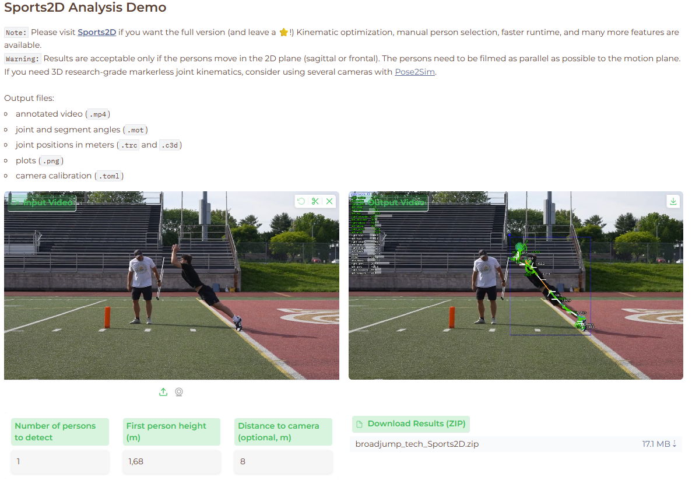
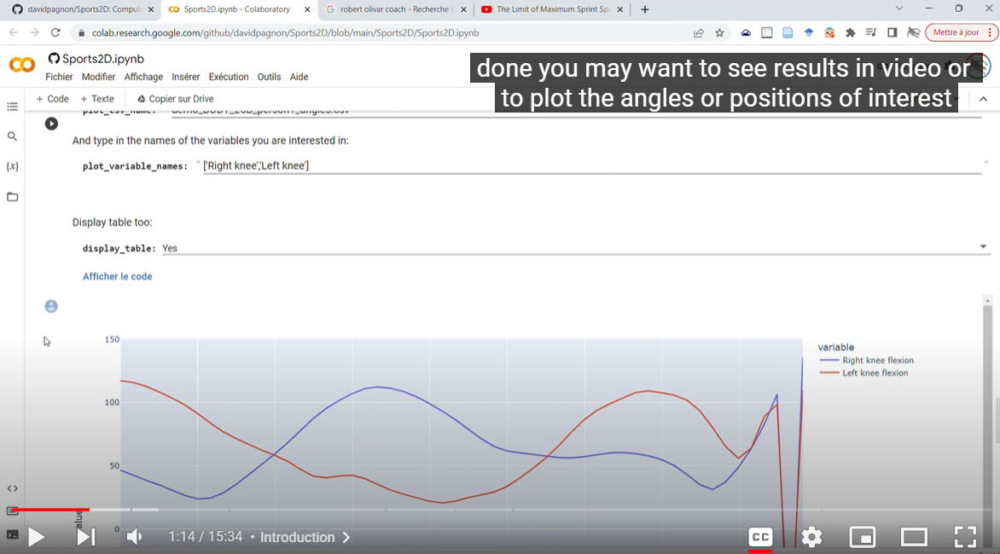
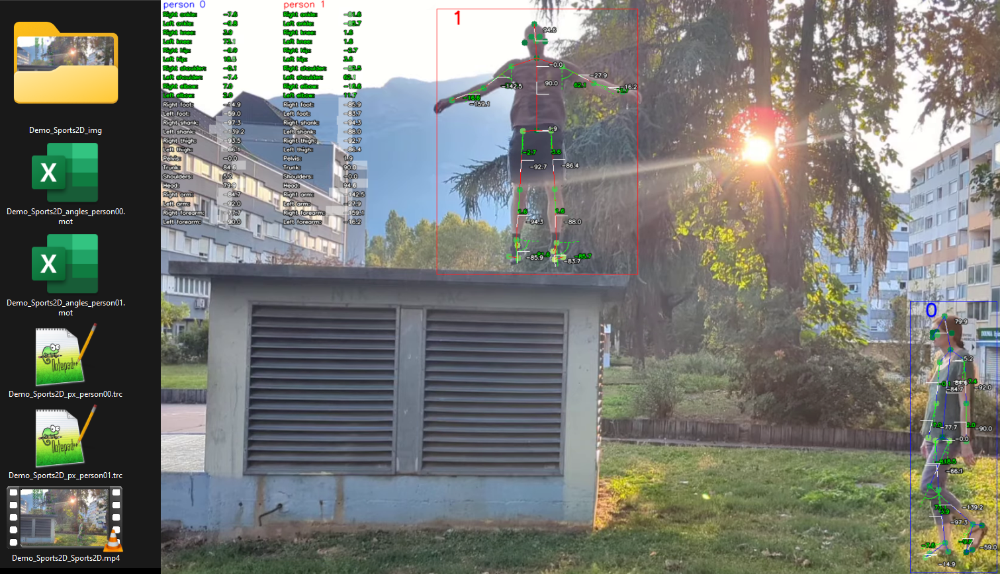
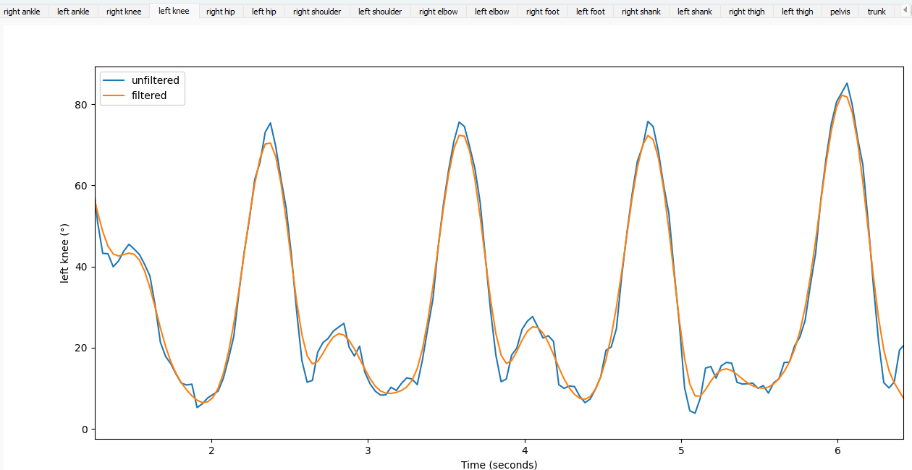
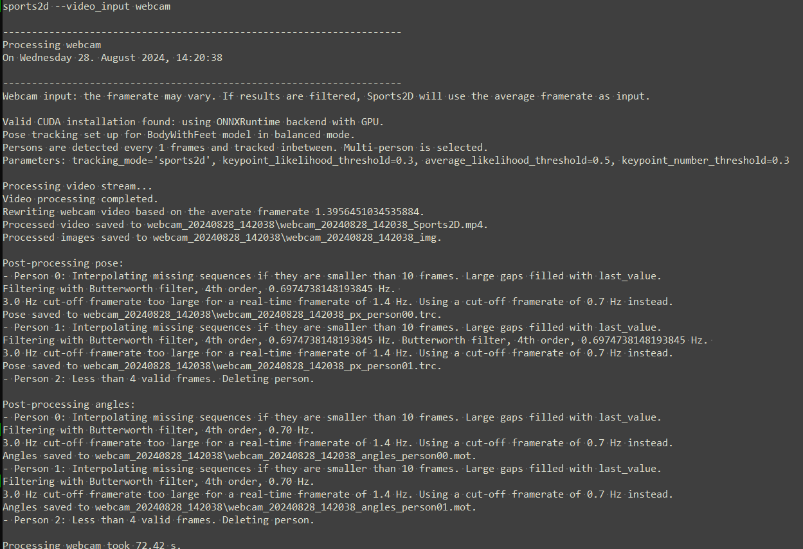
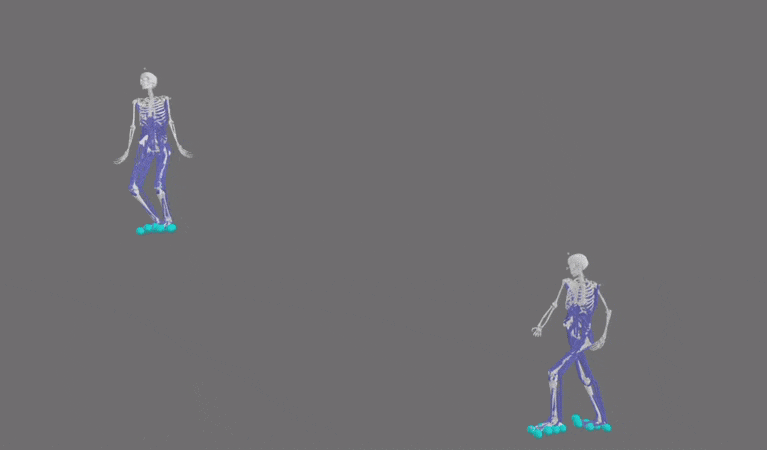
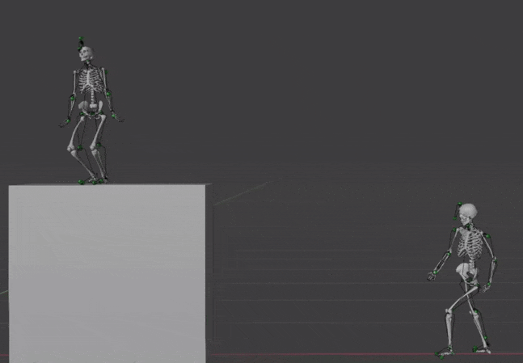
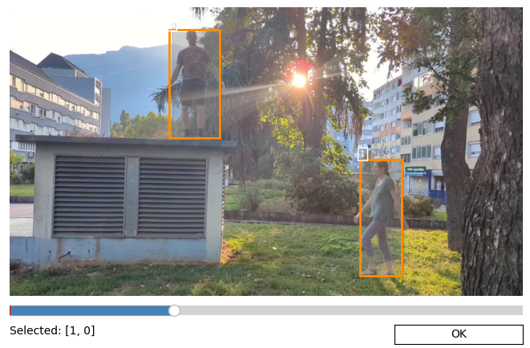
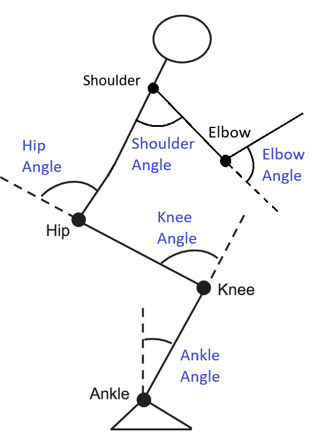

# Visit the website!

Please visit the website! (after leaving a **⭐star⭐**! 😇)

[https://davidpagnon.github.io/Sports2D](https://davidpagnon.github.io/Sports2D)


<br>

---

<br>


[](https://github.com/davidpagnon/sports2d/actions/workflows/continuous-integration.yml)
[](https://badge.fury.io/py/Sports2D)
\
[](https://pepy.tech/project/sports2d)
[](https://github.com/davidpagnon/sports2d/stargazers)
[](https://GitHub.com/davidpagnon/sports2d/forks)
[](https://github.com/davidpagnon/sports2d/issues)
[](https://GitHub.com/davidpagnon/sports2d/issues?q=is%3Aissue+is%3Aclosed)
\
[](https://joss.theoj.org/papers/1d525bbb2695c88c6ebbf2297bd35897)
[](https://zenodo.org/doi/10.5281/zenodo.7903962)
[](https://opensource.org/licenses/BSD-3-Clause)
\
[](https://discord.com/invite/4mXUdSFjmt)
[](https://huggingface.co/spaces/DavidPagnon/sports2d)
[](https://deepwiki.com/davidpagnon/Sports2D)


<!-- [](https://bit.ly/Sports2D_Colab)-->


# Sports2D


> [!WARNING]
> Since yesterday (7th June, 2026), the openmmlab website has been down and you cannot download their models anymore. This is a known issue, and I'm working to find a fix.


https://github.com/user-attachments/assets/2ce62012-f28c-4e23-b3b8-f68931bacb77

<!-- https://github.com/user-attachments/assets/6a444474-4df1-4134-af0c-e9746fa433ad -->

<!-- https://github.com/user-attachments/assets/1c6e2d6b-d0cf-4165-864e-d9f01c0b8a0e -->

**`Sports2D` automatically computes 2D keypoint trajectories, as well as joint and segment angles from a single video or a webcam.**

> [!NOTE]
> **Features:**
> 
> - 📈 Joint trajectories and angles 
> - 📹 Any Cameras (phones, webcams, GoPros...)
> - 👥 Multi-Person Support  (track multiple people simultaneously)
> - 🤸 Full OpenSim kinematics (complete skeletal analysis with joint angles)
> 
> **Use cases:**
> 
> - 🏀 Sports Analysis (field-based 2D motion capture)
> - 🏥 Clinical Assessment (gait analysis in doctor's office)
> - 🔬 Research (biomechanics studies with multiple participants)


> [!WARNING]
> - Angle estimation is only as good as the pose estimation algorithm, i.e., it is not perfect.
> - Results are acceptable only if the persons move in the 2D plane (sagittal or frontal). The persons need to be filmed as parallel as possible to the motion plane.
> - If you need 3D research-grade markerless joint kinematics, consider using several cameras with **[Pose2Sim](https://github.com/perfanalytics/pose2sim)**.

<br>

> [!IMPORTANT]
> If you like it, ⭐ please leave a star ⭐ on the [Sports2D GitHub repository](https://github.com/perfanalytics/sports2d)!\
> This project is completely free: this is your chance to support the project and make it more visible to the community.

> [!IMPORTANT]
> If you want to contribute to Sports2D or Pose2Sim, please see [How to contribute](#how-to-contribute-and-to-do-list) or join the Discord community! [](https://discord.com/invite/4mXUdSFjmt)

<!--User-friendly Colab version released! (and latest issues fixed, too)\
Works on any smartphone!**\
[](https://bit.ly/Sports2D_Colab)-->

</br>


<!--`Warning:` Google Colab does not follow the European GDPR requirements regarding data privacy. [Install locally](#installation) if this matters.-->

<!--`Know issue`: Results won't be good with some iPhone videos in portrait mode (unless you are working on Colab). This is solved by priorly converting them with `ffmpeg -i video_input.mov video_output.mp4`, or even more simply with any random online video converter such as https://video-converter.com.-->


# Contents
1. [Installation and Demonstration](#installation-and-demonstration)
   1. [Test it on Hugging face](#test-it-on-hugging-face)
   1. [Installation](#installation)
   2. [Demonstration](#demonstration)
   3. [Visualize in OpenSim or Blender](#visualize-in-opensim-or-blender)
2. [Play with the parameters](#play-with-the-parameters)
   1. [Run on a custom video or on a webcam](#run-on-a-custom-video-or-on-a-webcam)
   2. [Run for a specific time range](#run-for-a-specific-time-range)
   3. [Select the persons you are interested in](#select-the-persons-you-are-interested-in)
   4. [Get coordinates in meters](#get-coordinates-in-meters)
   5. [Run inverse kinematics](#run-inverse-kinematics)
   6. [Run on several videos at once](#run-on-several-videos-at-once)
   7. [Use the configuration file or run within Python](#use-the-configuration-file-or-run-within-python)
   8. [Get the angles the way you want](#get-the-angles-the-way-you-want)
   9. [Customize your output](#customize-your-output)
   10. [Use a custom pose estimation model](#use-a-custom-pose-estimation-model)
   11. [All the parameters](#all-the-parameters)
3. [Go further](#go-further)
   1. [Too slow for you?](#too-slow-for-you)
   2. [How it works](#how-it-works)
4. [How to cite and how to contribute](#how-to-cite-and-how-to-contribute)

<br>

# Installation and Demonstration


## Test it on Hugging face

> Test it on Hugging Face without installing anything!

Test an online, limited version [on Hugging Face](https://huggingface.co/spaces/DavidPagnon/sports2d): [](https://huggingface.co/spaces/DavidPagnon/sports2d)

<br>

Just drop your video, click Run Analysis, and look at the output video. You can also download the full results:

- Annotated video (.mp4)
- Joint and segment angles (.mot), OpenSim scaled model (.osim)
- Keypoint trajectories in meters (.trc and .c3d)
- Trajectory and angle plots (.png)
- Camera calibration file (.toml)

**Now runs marker augmentation and inverse kinematics, too!**

<br>



> [!TIP]
> Install locally for the full experience!\
> You'll be able to select persons manually, have a faster runtime, and access many more features, while keeping your data private.

<br>

## Installation

<!--- OPTION 0: **Use Colab** \
  User-friendly (but full) version, also works on a phone or a tablet.\
  [](https://bit.ly/Sports2D_Colab)\
  YouTube tutorial:\
  <a href = "https://www.youtube.com/watch?v=Er5RpcJ8o1Y"></a>
  
-->

> **Let's get started!**

<br>

> [!NOTE]
> If you'd rather use conda, you can still use the old [installation procedure](https://github.com/perfanalytics/pose2sim/tree/b1a8b84a59759946b321f8f243d19dcc31f7b5d6#installation). Still works fine but not recommended, since uv is faster, lighter, better at handling dependencies, and generally more modern. 

> [!TIP]
> If you have already installed Pose2Sim, skip the installation step. \
> Just [activate your environment](#activate-your-environment) and run:
> ```
> uv pip install sports2d --upgrade
> ```

<br>

### 1. Set up a uv environment:

Open a terminal (conda, powershell, bash, or zsh).

*On Windows:*

```powershell
  # Install uv
  powershell -ExecutionPolicy ByPass -c "irm https://astral.sh/uv/install.ps1 | iex"
  # Create uv environment
  uv venv "$env:USERPROFILE\.venv\pose2sim" --python 3.13 # or 3.11, or 3.12 
  # Activate the uv environment
  & "$env:USERPROFILE\.venv\pose2sim\Scripts\Activate.ps1"
```

<br>

*On Linux or MacOS:*

```bash
  # Install uv
  curl -LsSf https://astral.sh/uv/install.sh | sh
  # Create uv environment
  uv venv ~/.venv/pose2sim --python 3.13 # or 3.11, or 3.12 
  # Activate the uv environment
  source ~/.venv/pose2sim/bin/activate
```

> [!TIP]
> #### Activate your environment
> Remembering the command for activating the uv environment can be a pain. Just type **Ctrl+R** in your terminal and start typing `activate` to find it.

<br>

### 2. Install Sports2D:

Open a terminal (*conda, powershell, bash, or zsh*).\
[Activate your environment](#activate-your-environment).

- OPTION 1: **Latest stable version:** 

  ```bash
    uv pip install sports2d --upgrade
  ```

- OPTION 2: **For developers who want to test and edit the bleeding edge version:**

  ```bash
    git clone --depth 1 https://github.com/davidpagnon/sports2d.git
    cd sports2d
    uv pip install -e .
  ```

<br>

## Demonstration

> **Test the pipeline!**

<br>

Open a terminal (*conda, powershell, bash, or zsh*), [activate your environment](#activate-your-environment) and run:

``` bash
sports2d
```

You should see the joint positions and angles being displayed in real time.

The output files are in your current directory: 

- `.mp4` video
- `.trc` and `.c3d` pose, 
- `.mot` angles (can be opened with any spreadsheet software), 
- `.toml` calibration file,
- `.txt` logs.





> [!NOTE]
> Marker augmentation and inverse kinematics are not run by default, as they require the persons to be moving in a single plane for the whole selected time range. See [this section](#run-inverse-kinematics) for more detail.

> [!NOTE]
> The Demo video is voluntarily challenging to demonstrate the robustness of the process after sorting, interpolation and filtering. It contains:
> 
> - One person walking in the sagittal plane
> - One person doing jumping jacks in the frontal plane. This person then performs a flip while being backlit, both of which are challenging for the pose detection algorithm
> - One tiny person flickering in the background who needs to be ignored

<br>


## Visualize in OpenSim or Blender

> _**Visualize your results and look in detail for potential areas of improvement.**_ 

### Basic visualization with the OpenSim GUI

- **Install OpenSim GUI:**\
  Download the executable [there](https://simtk.org/projects/opensim).
- **Visualize point coordinates:**\
  `File > Preview Experimental Data`: Open your 3D marker .trc file (e.g., `demo_Sports2D_m_person00.trc`) from your `result_dir` folder.
- **Visualize angles:**\
  To open an animated model and run further biomechanical analysis, make sure you first set `--do_ik True`. See [inverse kinematics](#run-inverse-kinematics) section for more details.
  - `File > Open Model`: Open your scaled .osim model (e.g., `demo_Sports2D_m_person00_LSTM.osim`).
  - `File > Load Motion`: Open your joint angle .mot file (e.g., `demo_Sports2D_m_person00_LSTM_ik.mot`).



<br>

### Further investigation with the Pose2Sim Blender add-on

1. **Install the add-on.**\
   Follow instructions on the [Pose2Sim_Blender](https://github.com/davidpagnon/Pose2Sim_Blender) add-on page.

2. **Import the camera and video.**

   - **Cameras -> Import**: Open your `demo_calib.toml` file from your `result_dir` folder.
   - **Images/Videos -> Show**: open your video file (e.g., `demo_Sports2D.mp4`).\
   -> **Other tools -> See through camera**

2. **Open your point coordinates.**\
   **OpenSim data -> Markers**: Open your trc file(e.g., `demo_Sports2D_m_person00.trc`) from your `result_dir` folder.\
   This will optionally create **an animated rig** based on the motion of the captured person.

3. **Open your animated skeleton:**

   - **OpenSim data -> Model**: Open your scaled model (e.g., `demo_Sports2D_m_person00_LSTM.osim`). 
   - **OpenSim data -> Motion**: Open your motion file (e.g., `demo_Sports2D_m_person00_LSTM_ik.mot`). 



> [!NOTE]
> The OpenSim skeleton is not rigged yet. **[Feel free to contribute!](https://github.com/perfanalytics/pose2sim/issues/40)** [](https://discord.com/invite/4mXUdSFjmt)

<br>


# Play with the parameters

> [!TIP]
> For a full list of the available parameters:
> 
> - See [this section](#all-the-parameters) of the documentation, 
> - Check the [Config_Demo.toml](https://github.com/davidpagnon/Sports2D/blob/main/Sports2D/Demo/Config_demo.toml) file, or 
> - Type `sports2d --help`. Note: if an argument is not specified, it is set to its default value.

> [!TIP]
> Remember to first [activate your environment](#activate-your-environment).

<br>


## Run on a custom video or on a webcam

Try:

``` bash
 sports2d --video_input path_to_video.mp4
 # or
 sports2d --video_input webcam
```

<br>

> [!TIP]
> #### Minimize storage use:
> 
> The main drawback of working with videos is the size of the files. Here are some example settings (inspired by [Hardy et al, 2026](https://cvbw2026.github.io/assets/papers/4.pdf)) to significantly reduce storage use with little impact on accuracy:
> 
> - **Compress videos:** Increasing crf from 20 to 30 has virtually no impact on accuracy, and *decreases storage use by up to 10 times*.
> - **Decrease resolution:** Decreasing from HD (1080 x 1920) to SD (720 x 1280) has little impact, and *decreases storage use by about 8 times*.
> - **Audio does not matter:** Audio tracks take between 1 and (rarely) 10% of the file size.
> - **Face blurring:** Preserves privacy with little impact on accuracy. Use this [Utility script](https://github.com/perfanalytics/pose2sim/blob/main/Pose2Sim/Utilities/face_blurring.py).
> - **Keep high framerate:** Framerates below 60 Hz lead to accuracy drops, especially for fast motions.
> 
> In practice, here is how you can compress your video and decrease its resolution with ffmpeg:
> ```cmd
> ffmpeg -i original_vid.MP4 `
>   -vcodec libx264 -crf 30 -preset fast `
>   -vf "scale='min(1280,iw)':'min(720,ih)':force_original_aspect_ratio=decrease" `
>   -movflags +faststart `
>   lighter_vid.mp4
> ```

<br>

## Run for a specific time range

Try:

```bash
sports2d --time_range 1.2 2.7
```
 
<br>


## Select the persons you are interested in

If you only want to analyze a subset of the detected persons, you can use the `--nb_persons_to_detect` and `--person_ordering_method` parameters. The ordering of persons matters if you want to [convert coordinates in meters](#get-coordinates-in-meters) or [run inverse kinematics](#run-inverse-kinematics). 


``` bash
sports2d --nb_persons_to_detect 2 --person_ordering_method highest_likelihood
```

<br>

> [!TIP]
> **Recommended ordering method if you can afford a manual input:** `on_click`.\
> When prompted, select the persons you are interested in in the desired order.\
> Here, lets slide to a frame where both people are visible, and select the woman first, then the man.
> 
> If you want to run Sports2D without a screen, you can choose other ordering methods such as:
>
> - 'highest_likelihood', 
> - 'largest_size', 
> - 'smallest_size', 
> - 'greatest_displacement', 
> - 'least_displacement', 
> - 'first_detected', or 
> - 'last_detected'

``` bash
sports2d --person_ordering_method on_click
```



<br>


## Get coordinates in meters

> [!WARNING]
>  The Z coordinate (depth) should not be overly trusted. 

> [!NOTE]
> To convert from pixels to meters, you need a minima the height of a participant. 

#### How does it work?

- The pixel-to-meters scale is computed from the ratio between the height of the participant in meters and in pixels.\
  The height in pixels is automatically calculated; use the `--first_person_height` parameter to specify the height in meters.
- The camera horizon angle can be estimated with the `--floor_angle` argument, from kinematics (`auto`), from a calibration file (`from_calib`), or manually (float). 
- Likewise for the floor level, with the `--xy_origin` parameter, which can be determined from kinematics (`auto`), from a calibration file (`from_calib`), or manually (int, int). 
- Depth perspective effects can be compensated with the `--perspective_unit` and `--perspective_value` arguments, either with: 
  - The camera-to-person distance (`distance_m`, m), 
  - The focal length (`f_px`, px), 
  - The field-of-view (`fov_deg`, `fov_rad`, degrees or radians), 
  - A calibration file (`from_calib`, ''). 

If one of these parameters is set to `from_calib`, then use the `--calib_file` argument (path).\
**N.B.: A calibration file will be generated anyway.** 

<br>

Try:
``` bash
sports2d --first_person_height 1.65
```

``` bash
sports2d --first_person_height 1.65 `
        --floor_angle auto `
        --xy_origin auto`
        --perspective_unit distance_m --perspective_value 10
```
``` bash
sports2d --first_person_height 1.65 `
        --floor_angle 0 `
        --xy_origin from_calib`
        --perspective_unit from_calib --calib_file Sports2D\Demo\Calib_demo.toml
```
``` bash
sports2d --first_person_height 1.65 `
        --perspective_unit f_px --perspective_value 2520
```

<br>


## Run inverse kinematics

> [!WARNING]
> This requires the analyzed persons to be moving on a single plane for the whole selected time range. You can split your video into several time ranges if needed.

> [!NOTE]
> Scaling and inverse kinematics are done leveraging [Pose2Sim](https://github.com/perfanalytics/pose2sim).

OpenSim inverse kinematics allows you to set joint constraints and joint angle limits, to constrain the bones to have a fixed length, and potentially to have equal sizes on left and right side. Most generally, it gives more biomechanically accurate results. It can also give you the opportunity to compute joint torques, muscle forces, ground reaction forces, and more, [with MoCo](https://opensim-org.github.io/opensim-moco-site/) for example.

Model scaling is done according to the mean of the segment lengths, across a subset of frames. We remove the frames where the average knee and hip flexion angles are above 90° (pose estimation is not precise when the person is crouching) and the 50% most extreme segment values after the previous operations (potential outliers). These parameters can be edited in your Config.toml file.

```bash
sports2d --time_range 1.2 2.7 `
         --do_ik true --first_person_height 1.65 --visible_side auto front
```

<br>

> [!TIP]
> 
> - You can optionally use the [Stanford LSTM model](https://github.com/antoinefalisse/marker-augmentation) to estimate the position of 47 virtual markers.
> - You can also optionally give the participants proper masses. Mass has no influence on motion, only on forces (if you decide to further pursue kinetics analysis).
> - You can optionally [visualize the overlaid results in Blender](#visualize-in-blender). The automatic calibration won't be accurate with such a small time range, so you need to use the provided calibration file (or one that has been generated from the full walk).

```bash
sports2d --time_range 1.2 2.7 `
         --do_augmentation True --do_ik true `
         --participant_mass 55.0 67.0 --first_person_height 1.65 --visible_side left front `
         --calib_file Calib_demo.toml
```

<br>


## Run on several videos at once

Try:

``` bash
sports2d --video_input demo.mp4 other_video.mp4
```

<br>

Analyze all videos with the same time range:

```bash
sports2d --video_input demo.mp4 other_video.mp4 --time_range 1.2 2.7
```

<br>

Analyze different videos with time ranges:
```bash
sports2d --video_input demo.mp4 other_video.mp4 --time_range 1.2 2.7 0 3.5
```

<br>


## Use the configuration file or run within Python

If you have a lot of parameters to set, it can be more convenient to use a configuration file or to run within Python.

Use a configuration file:

``` bash
sports2d --config Config_demo.toml
```

<br>

Run within Python, with a configuration file. If needed, edit `Demo/Config_demo.toml` and run:
```python
from Sports2D import Sports2D
from pathlib import Path
import rtoml

config_path = Path(Sports2D.__file__).parent / 'Demo'/'Config_demo.toml'
config_dict = rtoml.load(config_path)
Sports2D.process(config_dict)
```

<br>

Run within Python with a dictionary of parameters (only non-default values need to be specified): 
```python
from Sports2D import Sports2D
config_dict = {
  'base': {
    'nb_persons_to_detect': 1,
    'person_ordering_method': 'greatest_displacement'
    },
  'pose': {
    'mode': 'lightweight', 
    'det_frequency': 50
    }}
Sports2D.process(config_dict)
```

<br>

## Get the angles the way you want

Choose which angles you need:

```bash
sports2d --joint_angles 'right knee' 'left knee' --segment_angles None
```

<br>

Choose where to display the angles.\
Either as a list on the upper-left of the image, or near the joint/segment, or both:

```bash
sports2d --display_angle_values_on body # OR none, or list
```

<br>

You can also decide not to calculate and display angles at all:

```bash
sports2d --calculate_angles false
```

<br>

Compensate for the estimated camera tilt angle when calculating segment angles:

```bash
sports2d --correct_segment_angles_with_floor_angle true # Default
```

> [!TIP]
> The camera tilt angle is automatically estimated. Set to false if the floor is actually tilted (rather than the camera) and you don't want to compensate for it.

<br>

> [!TIP]
> To run optimized **inverse kinematics with OpenSim** and potentially obtain more accurate angles, check [this section](#run-inverse-kinematics)

<br>

## Customize your output

Choose whether you want video, images, trc pose file, angle mot file, real-time display, and plots:

```bash
sports2d --save_vid false --save_img true `
         --save_pose false --save_angles true `
         --show_realtime_results false --show_graphs false
```

<br> 

Save results to a custom directory, specify the slow-motion factor:

``` bash
sports2d --result_dir path_to_result_dir
```

<br>


## Use a custom pose estimation model

Retrieve hand motion:

``` bash
sports2d --pose_model whole_body 
```

<br>

Use any custom (deployed) MMPose model:

``` bash
sports2d --pose_model BodyWithFeet : `
         --mode """{'det_class':'YOLOX', `
                'det_model':'https://download.openmmlab.com/mmpose/v1/projects/rtmposev1/onnx_sdk/yolox_m_8xb8-300e_humanart-c2c7a14a.zip', `
                'det_input_size':[640, 640], `
                'pose_class':'RTMPose', `
                'pose_model':'https://download.openmmlab.com/mmpose/v1/projects/rtmposev1/onnx_sdk/rtmpose-m_simcc-body7_pt-body7-halpe26_700e-256x192-4d3e73dd_20230605.zip', `
                'pose_input_size':[192,256]}"""
```

<br>


## All the parameters

For a full list of the available parameters, have a look at the [Config_Demo.toml](https://github.com/davidpagnon/Sports2D/blob/main/Sports2D/Demo/Config_demo.toml) file or type:

``` bash
sports2d --help
```

<br>

```bash
'config': ["C", "path to a toml configuration file"],

'video_input': ["i", "webcam, or video_path.mp4, or video1_path.avi video2_path.mp4 ... Beware that images won't be saved if paths contain non ASCII characters"],
'time_range': ["t", "start_time end_time. In seconds. Whole video if not specified. start_time1 end_time1 start_time2 end_time2 ... if multiple videos with different time ranges"],
'nb_persons_to_detect': ["n", "number of persons to detect. int or 'all'. 'all' if not specified"],
'person_ordering_method': ["", "'on_click', 'highest_likelihood', 'largest_size', 'smallest_size', 'greatest_displacement', 'least_displacement', 'first_detected', or 'last_detected'. 'on_click' if not specified"],
'first_person_height': ["H", "height of the reference person in meters. 1.65 if not specified. Not used if a calibration file is provided"],
'visible_side': ["", "front, back, left, right, auto, or none. 'auto front none' if not specified. If 'auto', will be either left or right depending on the direction the foot points to (does not work when both feet point towards the direction opposite to the motion, eg broad jump). If 'none', no IK for this person"],
'participant_mass': ["", "mass of the participant in kg or none. Defaults to 70 if not provided. No influence on kinematics (motion), only on kinetics (forces)"],
'perspective_value': ["", "Either camera-to-person distance (m), or focal length (px), or field-of-view (degrees or radians), or '' if perspective_unit=='from_calib'"],
'perspective_unit': ["", "'distance_m', 'f_px', 'fov_deg', 'fov_rad', or 'from_calib'"],
'do_augmentation': ["", "Use LSTM marker augmentation. false if not specified"],
'do_ik': ["", "do inverse kinematics. false if not specified"],
'filter_ik': ["", "Useful for force estimations if results are noisy. false if not specified"],
'ik_filter_type': ["", "'acc_minimizing', 'butterworth', 'kalman', 'one_euro', 'gcv_spline', 'gaussian', 'loess', 'median', or 'butterworth_on_speed'. 'acc_minimizing' if not specified"],
'load_trc_px': ["", "load trc file to avaid running pose estimation again. false if not specified"],
'compare': ["", "visually compare motion with trc file. false if not specified"],
'video_dir': ["d", "current directory if not specified"],
'result_dir': ["r", "current directory if not specified"],
'webcam_id': ["w", "webcam ID. 0 if not specified"],
'show_realtime_results': ["R", "show results in real-time. true if not specified"],
'display_angle_values_on': ["a", '"body", "list", "body" "list", or "none". body list if not specified'],
'show_graphs': ["G", "show plots of raw and processed results. true if not specified"],
'save_graphs': ["", "save position and angle plots of raw and processed results. true if not specified"],
'joint_angles': ["j", '"Right ankle" "Left ankle" "Right knee" "Left knee" "Right hip" "Left hip" "Right shoulder" "Left shoulder" "Right elbow" "Left elbow" if not specified'],
'segment_angles': ["s", '"Right foot" "Left foot" "Right shank" "Left shank" "Right thigh" "Left thigh" "Pelvis" "Trunk" "Shoulders" "Head" "Right arm" "Left arm" "Right forearm" "Left forearm" if not specified'],
'save_vid': ["V", "save processed video. true if not specified"],
'save_img': ["I", "save processed images. true if not specified"],
'save_pose': ["P", "save pose as trc files. true if not specified"],
'calculate_angles': ["c", "calculate joint and segment angles. true if not specified"],
'save_angles': ["A", "save angles as mot files. true if not specified"],
'slowmo_factor': ["", "slow-motion factor. For a video recorded at 240 fps and exported to 30 fps, it would be 240/30 = 8. 1 if not specified"],
'pose_model': ["p", "body_with_feet, whole_body_wrist, whole_body, lower_body, body, hand, face, animal. body_with_feet if not specified"],
'mode': ["m", 'light, balanced, performance, or a """{dictionary within triple quote}""". balanced if not specified. Use a dictionary to specify your own detection and/or pose estimation models (more about in the documentation).'],
'det_frequency': ["f", "run person detection only every N frames, and inbetween track previously detected bounding boxes. keypoint detection is still run on all frames.\n\
                  Equal to or greater than 1, can be as high as you want in simple uncrowded cases. Much faster, but might be less accurate. 1 if not specified: detection runs on all frames"],
'backend': ["", "Backend for pose estimation can be 'auto', 'cpu', 'cuda', 'mps' (for MacOS), or 'rocm' (for AMD GPUs)"],
'device': ["", "Device for pose estimatino can be 'auto', 'openvino', 'onnxruntime', 'opencv'"],
'to_meters': ["M", "convert pixels to meters. true if not specified"],
'make_c3d': ["", "Convert trc to c3d file. true if not specified"],
'floor_angle': ["", "angle of the floor (degrees). 'auto' if not specified"],
'xy_origin': ["", "origin of the xy plane. 'auto' if not specified"],
'calib_file': ["", "path to calibration file. '' if not specified, eg no calibration file"],
'save_calib': ["", "save calibration file. true if not specified"],
'feet_on_floor': ["", "offset marker augmentation results so that feet are at floor level. true if not specified"],
'distortions': ["", "camera distortion coefficients [k1, k2, p1, p2, k3] or 'from_calib'. [0.0, 0.0, 0.0, 0.0, 0.0] if not specified"],
'use_simple_model': ["", "IK 10+ times faster, but no muscles or flexible spine, no patella. false if not specified"],
'tracking_mode': ["", "'sports2d' or 'deepsort'. 'deepsort' is slower, harder to parametrize but can be more robust if correctly tuned"],
'deepsort_params': ["", 'Deepsort tracking parameters: """{dictionary between 3 double quotes}""". \n\
                    Default: max_age:30, n_init:3, nms_max_overlap:0.8, max_cosine_distance:0.3, nn_budget:200, max_iou_distance:0.8, embedder_gpu: True\n\
                    More information there: https://github.com/levan92/deep_sort_realtime/blob/master/deep_sort_realtime/deepsort_tracker.py#L51'],
'input_size': ["", "width, height. 1280, 720 if not specified. Lower resolution will be faster but less precise"],
'keypoint_likelihood_threshold': ["", "detected keypoints are not retained if likelihood is below this threshold. 0.3 if not specified"],
'average_likelihood_threshold': ["", "detected persons are not retained if average keypoint likelihood is below this threshold. 0.5 if not specified"],
'keypoint_number_threshold': ["", "detected persons are not retained if number of detected keypoints is below this threshold. 0.3 if not specified, i.e., i.e., 30 percent"],
'max_distance': ["", "If a person is detected further than max_distance from its position on the previous frame, it will be considered as a new one. in px or None, 100 by default."],
'max_unseen_time': ["", "If a person is not seen for more than max_unseen_time seconds, they are considered stale and they won't be confused with a person passing by. 1 second by default."],
'large_hip_knee_angles': ["", "Hip and knee angles beyond this value are considered as imprecise. Defaults to 135°"],
'trimmed_extrema_percent': ["", "Proportion of the most extreme segment values to remove before calculating their mean. Defaults to 50"],
'fontSize': ["", "font size for angle values. 0.3 if not specified"],
'flip_left_right': ["", "DEPRECATED. This parameter is ignored."],
'correct_segment_angles_with_floor_angle': ["", "true or false. If the camera is tilted, corrects segment angles as regards to the floor angle. Set to false if it is actually the floor which is tilted, not the camera. True if not specified"],
'interpolate': ["", "interpolate missing data. true if not specified"],
'interp_gap_smaller_than': ["", "interpolate sequences of missing data if they are less than N frames long. 10 if not specified"],
'fill_large_gaps_with': ["", "last_value, nan, or zeros. last_value if not specified"],
'sections_to_keep': ["", "all, largest, first, or last.  Keep 'all' valid sections even when they are interspersed with undetected chunks, or the 'largest' valid section, or the 'first' one, or the 'last' one"],
'min_chunk_size': ["", "Minimum number of valid frames in a row to keep a chunk of data for a person.  10 if not specified"],
'reject_outliers': ["", "reject outliers with Hampel filter before other filtering methods. true if not specified"],
'filter': ["", "filter results. true if not specified"],
'filter_type': ["", "utterworth, acc_minimizing, kalman, one_euro, gcv_spline, gaussian, LOESS, median, butterworth_on_speed. butterworth if not specified"],
'cut_off_frequency': ["", "cut-off frequency of the Butterworth filter. 6 if not specified"],
'order': ["", "order of the Butterworth filter. 4 if not specified"],
'trust_ratio': ["", "trust ratio of the Kalman filter: How much more do you trust triangulation results (measurements), than the assumption of constant acceleration(process)? 500 if not specified"],
'smooth': ["", "dual Kalman smoothing. true if not specified"],
'oneeuro_cut_off_frequency': ["", "cutoff frequency, similar to Butterworth but adapts to velocity (with beta). 4.0 if not specified"],
'oneeuro_beta': ["", "beta parameter of the One Euro filter. Higher beta values will lead to more smoothing when the signal is slow, and less smoothing when the signal is fast. 1.5 if not specified"],
'oneeuro_d_cut_off_frequency': ["", "cut-off frequency of the derivative of the signal for the One Euro filter. 1.0 if not specified"],
'gcv_cut_off_frequency': ["", "cut-off frequency of the GCV spline filter. 'auto' is usually better, unless the signal is too short (noise can then be considered as signal -> trajectories not filtered). 'auto' if not specified"],
'gcv_smoothing_factor': ["", "smoothing factor of the GCV spline filter (>=0). Ignored if cut_off_frequency != 'auto'. Biases results towards more smoothing (>1) or more fidelity to data (<1). 1.0 if not specified"],
'accminimizing_cut_off_frequency': ["", "cut-off frequency of the acceleration-minimizing filter. 6.0 if not specified"],
'sigma_kernel': ["", "sigma of the gaussian filter. 1 if not specified"],
'nb_values_used': ["", "number of values used for the loess filter. 5 if not specified"],
'kernel_size': ["", "kernel size of the median filter. 3 if not specified"],
'butterspeed_order': ["", "order of the Butterworth filter on speed. 4 if not specified"],
'butterspeed_cut_off_frequency': ["", "cut-off frequency of the Butterworth filter on speed. 6 if not specified"],
'osim_setup_path': ["", "path to OpenSim setup. '../OpenSim_setup' if not specified"],
'right_left_symmetry': ["", "right left symmetry. true if not specified"],
'default_height': ["", "default height for scaling. 1.70 if not specified"],
'remove_individual_scaling_setup': ["", "remove individual scaling setup files generated during scaling. true if not specified"],
'remove_individual_ik_setup': ["", "remove individual IK setup files generated during IK. true if not specified"],
'use_custom_logging': ["", "use custom logging. false if not specified"]
```

<br>


# Go further

## Too slow for you?

#### Quick fixes

- Use ` --save_vid false --save_img false --show_realtime_results false`.\
  Processed images and videos won't be saved, and real-time results won't be displayed. 
- Use `--mode lightweight`.\
  Will use a lighter version of RTMPose, which is faster but less accurate.\
  Note that any detection and pose models can be used (if you do not have their .onnx or .zip files, first [deploy them with MMPose](https://mmpose.readthedocs.io/en/latest/user_guides/how_to_deploy.html#onnx)):
  ```
  --mode """{'det_class':'YOLOX',
          'det_model':'https://download.openmmlab.com/mmpose/v1/projects/rtmposev1/onnx_sdk/yolox_nano_8xb8-300e_humanart-40f6f0d0.zip',
          'det_input_size':[416,416],
          'pose_class':'RTMPose',
          'pose_model':'https://download.openmmlab.com/mmpose/v1/projects/rtmposev1/onnx_sdk/rtmpose-t_simcc-body7_pt-body7_420e-256x192-026a1439_20230504.zip',
          'pose_input_size':[192,256]}"""
  ```
- Use `--det_frequency 50` (or more).\
  Rtmlib is (by default) a top-down method: detects bounding boxes for every person in the frame, and then detects keypoints inside of each box. The person detection stage is much slower. You can choose to detect persons only every 50 frames (for example), and track bounding boxes inbetween, which is much faster.
- Use `--load_trc_px <path_to_file_px.trc>`.\
  Will use pose estimation results from a trc file (in pixels). Useful if you want to quickly compare results using different parameters for pixel to meter conversion, angle calculation, or more, without running detection and pose estimation all over.
- Make sure you use `--tracking_mode sports2d`.\
  Will use the default Sports2D tracker. Unlike DeepSort, it is faster, does not require any parametrization, and is as good in non-crowded scenes. 

<br> 

#### Use your GPU
Will be much faster, with no impact on accuracy. However, the installation takes about 6 GB of additional storage space.

1. Run `nvidia-smi` in a terminal. If this results in an error, your GPU is probably not compatible with CUDA. If not, note the "CUDA version": it is the latest version your driver is compatible with (more information [on this post](https://stackoverflow.com/questions/60987997/why-torch-cuda-is-available-returns-false-even-after-installing-pytorch-with)).

   Then go to the [ONNXruntime requirement page](https://onnxruntime.ai/docs/execution-providers/CUDA-ExecutionProvider.html#requirements), note the latest compatible CUDA and cuDNN requirements. Next, go to the [pyTorch website](https://pytorch.org/get-started/previous-versions/) and install the latest version that satisfies these requirements (beware that torch 2.4 ships with cuDNN 9, while torch 2.3 installs cuDNN 8). For example:
   ``` bash
   pip3 install torch torchvision torchaudio --index-url https://download.pytorch.org/whl/cu124
   ```

<!-- > ***Note:*** Issues were reported with the default command. However, this has been tested and works:
`pip install torch==2.3.1 torchvision==0.18.1 torchaudio==2.3.1 --index-url https://download.pytorch.org/whl/cu118` -->

2. Finally, install ONNX Runtime with GPU support:
   ```
   pip uninstall onnxruntime
   pip install onnxruntime-gpu
   ```

3. Check that everything went well within Python with these commands:
   ``` bash
   python -c 'import torch; print(torch.cuda.is_available())'
   python -c 'import onnxruntime as ort; print(ort.get_available_providers())'
   # Should print "True ['CUDAExecutionProvider', ...]"
   ```
   <!-- print(f'torch version: {torch.__version__}, cuda version: {torch.version.cuda}, cudnn version: {torch.backends.cudnn.version()}, onnxruntime version: {ort.__version__}') -->


<!--

VIDEO THERE

-->


<br>


## How it works

> [!NOTE]
> Sports2D:
> 
> - Detects 2D joint centers from a video or a webcam with RTMLib.
> - Converts pixel coordinates to meters.
> - Computes selected joint and segment angles. 
> - Optionally performs kinematic optimization via OpenSim.
> - Optionally saves processed image and video files. 

### Okay but how does it work, really?

Alright, here is more detail. Sports2D:

1. **Reads stream from a webcam, from one video, or from a list of videos**.\
Optionally selects the specified time range to process.

2. **Sets up pose estimation with RTMLib.**\
It can be run in lightweight, balanced, or performance mode, and for faster inference, the person bounding boxes can be tracked instead of detected for every frame. Any RTMPose model can be used. 

3. **Tracks people** so that their IDs are consistent across frames.\
A person is associated to another in the next frame when they are at a small distance. IDs remain consistent even if the person disappears from a few frames, thanks to the 'sports2D' tracker. [See Release notes of v0.8.22 for more information](https://github.com/davidpagnon/Sports2D/releases/tag/v0.8.22). 

4. **Chooses which persons to analyze.**\
You can choose the number of persons to analyze (`nb_persons_to_detect`), and how to order them (`person_ordering_method`).\
The ordering method can be 'on_click', 'highest_likelihood', 'largest_size', 'smallest_size', 'greatest_displacement', 'least_displacement', 'first_detected', or 'last_detected'. `on_click` is default and lets the user click on the persons they are interested in, in the desired order.

4. **Converts the pixel coordinates to meters.**

  - The user can provide the size of a specified person to scale results accordingly.
  - The camera horizon angle and the floor level can either be detected automatically from the gait sequence, be manually specified, or obtained frmm a calibration file.
  - The depth perspective effects are compensated with the distance from the camera to the subject, the focal length, the field of view, or from a calibration file. [See Release notes of v0.8.25 for more information](https://github.com/davidpagnon/Sports2D/releases/tag/v0.8.25). 

5. **Computes the selected joint and segment angles**, and flips them if the person is changing direction. 

5. **Draws the results on the image:**

  - Draws bounding boxes around each person and writes their IDs.\
  - Draws the skeleton and the keypoints, with a green to red color scale to account for their confidence.\
  - Draws joint and segment angles on the body, and writes the values either near the joint/segment, or on the upper-left of the image with a progress bar.

6. **Interpolates and filters results:**

   1. Right/Left swaps are not corrected yet (working on it), 
   2. Missing pose and angle sequences are interpolated unless gaps are too large, 
   3. Outliers are rejected with a Hampel filter, 
   4. Results are filtered, by default with a 6 Hz Butterworth filter. 
   
   All of the above can be configured or deactivated, and other filters such as Kalman, GCV, Gaussian, LOESS, Median, and Butterworth on speeds are also available (see [Config_Demo.toml](https://github.com/davidpagnon/Sports2D/blob/main/Sports2D/Demo/Config_demo.toml))

7. **Optionally shows** processed images, saves them, or saves them as a video\
  **Optionally plots** pose and angle data before and after processing for comparison\
  **Optionally saves** poses for each person as a TRC file in pixels and meters, angles as a MOT file, and calibration data as a [Pose2Sim](https://github.com/perfanalytics/pose2sim) TOML file 

8. **Optionally runs scaling and inverse kinematics** with OpenSim via [Pose2Sim](https://github.com/perfanalytics/pose2sim).

<br>

### Angle conventions

**Joint angle conventions:**

- Ankle dorsiflexion: Between heel and big toe, and ankle and knee.\
  *-90° when the foot is aligned with the shank.*
- Knee flexion: Between hip, knee, and ankle.\
  *0° when the shank is aligned with the thigh.*
- Hip flexion: Between knee, hip, and shoulder.\
  *0° when the trunk is aligned with the thigh.* 
- Shoulder flexion: Between hip, shoulder, and elbow.\
  *180° when the arm is aligned with the trunk.*
- Elbow flexion: Between wrist, elbow, and shoulder.\
  *0° when the forearm is aligned with the arm.*

**Segment angle conventions:**\
Angles are measured anticlockwise between the horizontal and the segment.

- Foot: Between heel and big toe
- Shank: Between ankle and knee
- Thigh: Between hip and knee
- Pelvis: Between left and right hip
- Trunk: Between hip midpoint and shoulder midpoint
- Shoulders: Between left and right shoulder
- Head: Between neck and top of the head
- Arm: Between shoulder and elbow
- Forearm: Between elbow and wrist




<br> 

# How to cite and how to contribute

### How to cite
If you use Sports2D, please cite [Pagnon, 2024](https://joss.theoj.org/papers/10.21105/joss.06849).

     @article{Pagnon_Sports2D_Compute_2D_2024,
       author = {Pagnon, David and Kim, HunMin},
       doi = {10.21105/joss.06849},
       journal = {Journal of Open Source Software},
       month = sep,
       number = {101},
       pages = {6849},
       title = {{Sports2D: Compute 2D human pose and angles from a video or a webcam}},
       url = {https://joss.theoj.org/papers/10.21105/joss.06849},
       volume = {9},
       year = {2024}
     }
     

### How to contribute

> [!TIP]
> If you want to contribute to Sports2D or Pose2Sim, please see [this issue](https://github.com/perfanalytics/pose2sim/issues/40) or join the Discord community! [](https://discord.com/invite/4mXUdSFjmt)

</br>

**Sports2D releases (details [here](https://github.com/davidpagnon/sports2d))**

- [x] More flexible, easier to run
- [x] Better visualization output 
- [x] Works from a webcam
- [x] Faster, more accurate
- [x] Results in meters rather than pixels. **New in v0.5!**
- [x] Any detector and pose estimation model can be used. **New in v0.6!**
- [x] MarkerAugmentation and Inverse Kinematics for accurate 3D motion with OpenSim. **New in v0.7!** 
- [x] Select only the persons you want to analyze **New in v0.8!** 
- [x] Compensate for floor angle, floor height, depth perspective effects, generate a calibration file **New in v0.8.25!** 
- [x] Easier, lighter, faster installation, with marker augmentation and inverse kinematics available by default! **New in v0.8.31!**

Run `uv pip install sports2d --upgrade` to get the latest version.

</br>

**Main to-do list:**

- [x] Compute **segment angles**.
- [x] **Multi-person** detection, consistent over time.
- [x] **Only interpolate small gaps**.
- [x] **Filtering and plotting tools**.
- [x] Handle sudden **changes of direction**.
- [x] **Batch processing** for the analysis of multiple videos at once.
- [x] Option to only save one person (with the highest average score, or with the most frames and fastest speed)
- [x] Run again without pose estimation with the option `--load_trc_px` for px .trc file.
- [x] **Convert positions to meters** by providing the person height, a calibration file, or 3D points [to click on the image](https://stackoverflow.com/questions/74248955/how-to-display-the-coordinates-of-the-points-clicked-on-the-image-in-google-cola)
- [x] Support any detection and/or pose estimation model.
- [x] Optionally let user select the persons of interest.
- [x] Perform **Inverse kinematics and dynamics** with OpenSim (cf. [Pose2Sim](https://github.com/perfanalytics/pose2sim), but in 2D). Update [this model](https://github.com/davidpagnon/Sports2D/blob/main/Sports2D/Utilities/2D_gait.osim) (add arms, markers, remove muscles and contact spheres). Add pipeline example.
- [ ] Animal pose estimation and inverse kinematics. Would require adding animal models to the OpenSim setup, and supporting animal pose estimation models in Sports2D.
- [ ] Take distortions into account
- [ ] Fix leg swaps
- [ ] Split ugly big process() function into smaller ones, and make the code more modular and easier to read.

</br>

- [ ] Run with the option `--compare_to` to visually compare motion with a trc file. If run with a webcam input, the user can follow the motion of the trc file. Further calculation can then be done to compare specific variables.
- [ ] **Colab version**: more user-friendly, usable on a smartphone.
- [ ] **GUI applications** for Windows, Mac, and Linux, as well as for Android and iOS.
- [ ] **Track other points and angles** with classic tracking methods (cf. [Kinovea](https://www.kinovea.org/features.html)), or by training a model (cf. [DeepLabCut](https://deeplabcut.github.io/DeepLabCut/README.html)).
- [ ] **Pose refinement**. Click and move badly estimated 2D points. See [DeepLabCut](https://www.youtube.com/watch?v=bEuBKB7eqmk) for inspiration.
- [ ] Add tools for annotating images, undistort them, take perspective into account, etc. (cf. [Kinovea](https://www.kinovea.org/features.html)).

